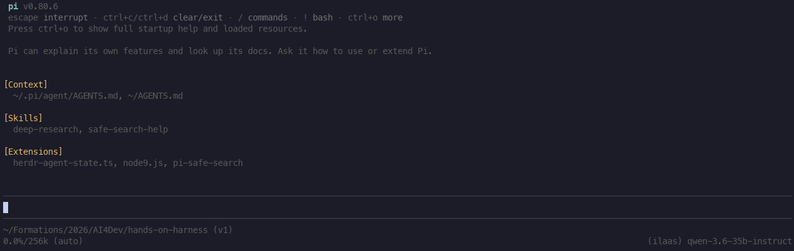

# Le harnais de départ : Pi

::: tip Objectifs de ce module
- Pourquoi utiliser Pi
- Lancer Pi et comprendre le rôle du répertoire `.pi/`
- Situer les quatre extensions que nous utiliserons pour incarner la grille des briques
- Cadrer honnêtement l'exercice de reconstruction
:::

Nous avons vu précédemment qu'un harnais était un ensemble d'outils au-dessus des modèles LLM. Chacun peut jouer un rôle essentiel dans l'accomplissement d'une tâche en toute autonomie. Vous avez à votre disposition un ensemble de harnais déjà construits : claude code, codex, opencode, Pi... Mais dans la plupart des cas, vous ne maîtrisez rien et vous vous laissez guider en espérant que ça fasse ce que vous lui avez demandé. Si quelque chose se passe mal, il n'est pas forcément aisé de comprendre pourquoi. Or, notre objectif est justement de comprendre comment marche un harnais dans le moindre de ses détails. Nous souhaitons pouvoir ajouter ou retirer facilement un élément à celui-ci et en tester les conséquences.

Dans la suite, nous allons utiliser [Pi](https://pi.dev), un agent de code en ligne de commande, ouvert et extensible qui est minimaliste. Ce qui va nous intéresser c'est précisément la possibilité de lui ajouter des extensions simplement et de comprendre tout ce qui se passe à l'intérieur sans surprises : une maîtrise de bout en bout.

## Ce qu'est Pi

Pi est un agent de code qui tourne dans votre terminal créé initialement par Mario Zechner. Son but premier était justement d'avoir la maîtrise de son harnais. Pi repose sur une poignée d'outils de base — lire un fichier, en écrire un, l'éditer, exécuter une commande shell — et sur une boucle agentique qui enchaîne les appels au modèle, l'exécution des outils et la relecture des résultats. C'est exactement la boucle que nous avons décrite au module précédent, réduite à sa plus simple expression.

Autour de ce noyau, Pi expose un système d'extensions et d'événements. Vous pouvez vous brancher sur les moments clés de la boucle avec `pi.on(...)`, de la même façon qu'on branche des hooks dans Claude Code.

Comme Claude Code s'appuie sur un répertoire `.claude/`, Pi s'appuie sur un répertoire `.pi/`. C'est là que vivent la configuration, les skills, les agents et les règles de permission. Vous pouvez le considérer comme l'équivalent, côté Pi, de ce que vous connaissez peut-être déjà côté Claude Code.

Pi se connaît très bien et est donc en mesure de vous aider pour étendre ses fonctionnalités. Tout est décrit dans son "system prompt" comme vous le verrez dans un instant.

## Premiers pas

Pour installer Pi, il vous suffit de vous rendre sur le site officiel https://pi.dev et de vous laisser guider.

Ensuite, il vous faut installer des modèles qui vous serviront tout au long de vos expériences. Vous avez plusieurs façons de renseigner votre fournisseur de modèles: https://pi.dev/docs/latest/providers. Nous vous encourageons à avoir un modèle assez puissant pour faire de la planification de bonne qualité et un modèle plus rapide qui va coder au fur et à mesure ce que le planificateur aura établi comme tâches.

Pour celles et ceux qui suivent cette formation en présentiel, nous vous proposons d'utiliser les modèles mis à disposition par [ILaaS](https://www.ilaas.fr/) qui est une plateforme mutualisée visant une IA générative de confiance, robuste, éthique et sobre. Ce service provient du monde académique français.

Vous devez éditer ce fichier `~/.pi/agent/models.json` et le remplir de la manière suivante :

```json
{
    "providers": {
        "ilaas": {
            "baseUrl": "https://llm.ilaas.fr/v1",
            "api": "openai-completions",
            "apiKey": "XXXXX",
            "models": [
                {
                    "id": "gemma-4-31b",
                    "contextWindow": 128000,
                    "reasoning": true
                },
                {
                    "id": "qwen-3.6-35b-instruct",
                    "contextWindow": 256000
                }
            ]
        },
    }
}
```

Vous devrez renseigner l'api key qui vous aura été fournie. Les modèles annoncés sont ceux disponibles lors de la formation. N'hésitez pas à aller sur la page d'IlaaS pour les mises à jour (https://www.ilaas.fr/liste-des-modeles-llms/).

Si tout s'est bien passé, vous devrez pouvoir utiliser Pi. Lancez une première session interactive avec `pi` dans votre terminal et vérifier que vous avez un prompt. Quelque chose comme



Vous pouvez constater les différents éléments que composent Pi (contexte, skills, extensions) ainsi que le modèle utilisé par défaut en bas à droite (ici `(ilaas) qwen-3.6-35b-instruct`).

Vous pouvez jouer avec en lui posant des questions, observer la boucle et voir comment il vous répond. Essayez ensuite le mode non interactif avec `pi -p`, qui exécute une requête et rend la main.

## Les premières commandes utiles

- Les outils
    Comme dit en introduction de cette partie, Pi est livré avec 4 outils. Pour obtenir la liste, il vous suffit de tapez

    ```
    /tools
    ```

    Vous devriez voir au moins les outils : read, bash edit, write.

    ::: info Exercice
    À partir du prompt, essayez grâce à votre question de déclencher chacun de ces outils.
    :::

- L'arborescence de votre session

    Il peut être utile de naviguer dans votre session et repartir à une des étapes de votre discussion. Pour cela, il faut utiliser la commande

    ```
    \tree
    ```

    ::: info Exercice
    Essayez de repartir d'un point de votre fil de discussion.
    :::

- Reprendre une session précédente

    Vous pouvez repartir de n'importe quelles sessions précédentes à l'aide de la commande

    ```
    \resume
    ```

    ::: info Exercice
    Essayez de repartir d'une session précédente.
    :::

- Exporter sa session

    Enfin, vous pouvez exporter votre session au format html ou json via la commande

    ```
    \export
    ```

    ::: info Exercice
    Faites un export de votre session en html (format par défaut) et ouvrez ce fichier. Vous pouvez enfin voir à quoi ressemble de "system prompt" minimal de Pi !
    :::

Nous avons fait le tour des principales commandes que nous jugeons utiles pour le moment. Nous en verrons d'autres au cours de ce périple.

## Comprendre le contenu des répertoires Pi

## Installer une extension


## Les quatre extensions

Pour incarner la grille des briques, nous nous appuierons sur quatre extensions, chacune correspondant à une brique. `pi-rtk-optimizer` prendra en charge le contexte et la compaction. `@tintinweb/pi-subagents` fournira la délégation. `pi-hermes-memory` portera la mémoire. `pi-lens` complétera l'observabilité et l'outillage de code. Les permissions et les outils, eux, seront reconstruits à la main dans `.pi/skills/`.

Nous les introduisons ici comme un inventaire ; chaque extension sera présentée en détail au moment où sa brique est reconstruite.

## La table de correspondance

Le fil conducteur de la formation tient dans une table à trois colonnes. La première rappelle l'invariant, c'est-à-dire le principe durable de chaque brique. La deuxième montre comment un harnais réel le réalise, en s'appuyant sur ce que le *leak* nous apprend de Claude Code. La troisième indique comment nous le reconstruisons sur Pi. Une quatrième colonne reste vide : c'est la vôtre, à remplir avec vos propres intentions d'usage.

| Invariant           | Dans Claude Code                 | Reconstruit sur Pi                   | Votre harnais ? |
| ------------------- | -------------------------------- | ------------------------------------ | --------------- |
| Contexte et cache   | frontière statique / dynamique   | `pi-rtk-optimizer`                   |                 |
| Outils              | plugins gardés par permission    | skills dans `.pi/skills/`            |                 |
| Délégation          | sous-agent isolé, exposé en outil| `@tintinweb/pi-subagents`           |                 |
| Mémoire             | lecture/écriture + filtrage      | `pi-hermes-memory`                   |                 |
| Sûreté              | modes et règles de refus         | pipeline `.pi/skills/permissions/`  |                 |

## Un cadrage honnête

Deux points doivent être dits clairement avant de commencer.

Le premier est que notre but n'est pas d'égaler Claude Code. La reconstruction que nous menons est minimale, et elle le restera. Ce que nous cherchons, c'est à comprendre assez bien chaque brique pour être capable d'en construire une adaptée à nos besoins.

Le second est une tension que nous préférons aborder de front. Claude Code sait désormais écrire son propre harnais à la volée, selon la tâche. On peut alors se demander à quoi bon apprendre à le construire à la main. La réponse tient en une phrase : on ne pilote, on n'audite et on n'adapte que ce que l'on comprend. Savoir construire manuellement reste la condition pour garder la main sur ce que l'agent fait à votre place.

## En pratique

Récupérez l'état du dépôt de la formation, faites répondre Pi via l'accès aux modèles, et remplissez la quatrième colonne de la table avec vos propres usages : sur quel type de tâches aimeriez-vous fiabiliser votre travail ? Cette colonne vous accompagnera jusqu'au capstone de l'acte 4.

::: warning Un piège à connaître
L'événement `input` se déclenche *avant* l'expansion des skills. Si vous préfixez vos entrées par une commande `/`, elle risque de ne pas être reconnue au moment où votre hook s'exécute. Nous y reviendrons quand nous brancherons des hooks sur cet événement.
:::

## Pour aller plus loin

- Le [site officiel de Pi](https://pi.dev/) et sa [documentation](https://github.com/earendil-works/pi/tree/main/packages/coding-agent/docs).
- [Awesome Pi Coding Agent](https://awesome-pi.site/extensions/), l'annuaire communautaire des extensions et ressources autour de Pi.
- Le paquet [`@earendil-works/pi-coding-agent`](https://www.npmjs.com/package/@earendil-works/pi-coding-agent) sur npm, pour les versions et l'installation.
- Anthropic, [A harness for every task](https://claude.com/blog/a-harness-for-every-task-dynamic-workflows-in-claude-code), sur la capacité de Claude Code à écrire son propre harnais.
