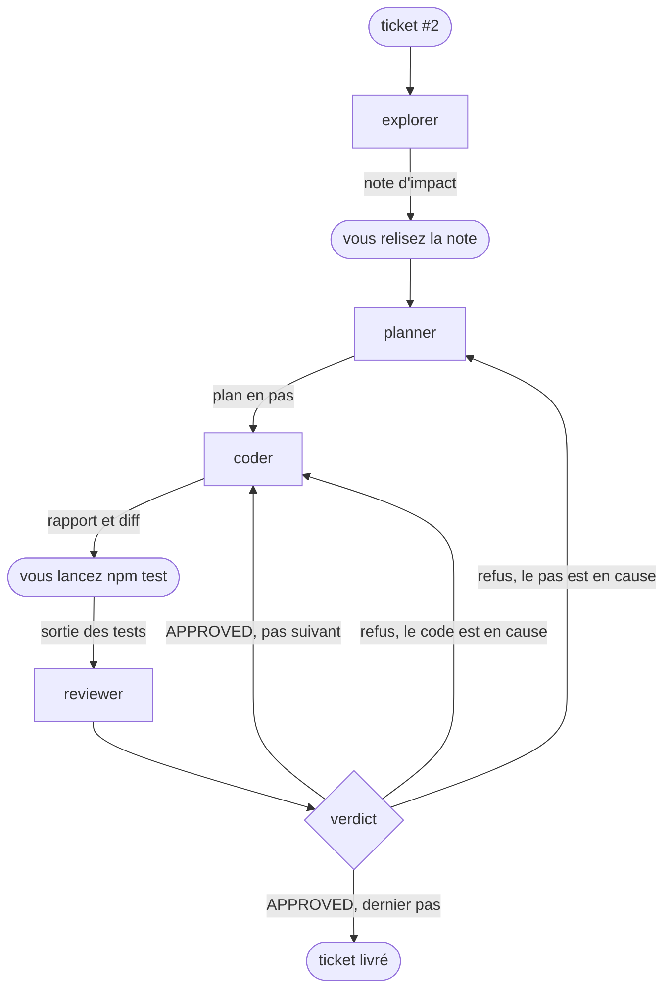

# Les workflows : la boucle écrite dans un fichier

::: tip Objectifs de ce module
- Reconnaître dans la boucle du module précédent les motifs d'un flux de travail
- Écrire cette boucle dans un fichier que Pi déroule seul
- Faire des tests le juge final, et choisir où l'humain garde la main
- Adapter ce fichier à ses propres besoins en quelques lignes
:::

Dans le module précédent, vous étiez l'orchestrateur. Vous lanciez chaque agent avec `/step`, vous relisiez la note, vous lanciez `npm test` dans un second terminal et vous décidiez, après chaque verdict, qui reprenait la main. C'est instructif une fois. Refaire ces gestes vingt fois l'est beaucoup moins, et c'est précisément le genre de tâche répétitive qu'il faut automatiser.

Ce module écrit ces gestes dans un fichier. combo appelle ce fichier un **flow** : un graphe de tâches décrit en YAML et en markdown, posé à côté de vos agents, et déroulé par le code plutôt que par un modèle. Nous allons voir qu'il n'y a pas de langage à apprendre et que votre harnais se modifie comme n'importe quel fichier de configuration.

Nous vous rappelons que l'outil combo a été écrit spécifiquement pour cette formation et qu'il n'est peut-être pas souhaitable de l'utiliser en production aujourd'hui. Ce ne sera peut-être plus le cas à terme. L'idée est toujours de vous permettre d'expérimenter rapidement et facilement.

::: info Pourquoi combo plutôt qu'Archon ou Fabro ?
D'autres outils écrivent déjà la boucle d'un agent de code dans un fichier et servent au quotidien. [Archon](https://github.com/coleam00/Archon) décrit un workflow comme un graphe YAML rangé dans `.archon/workflows/`, y mêle des nœuds déterministes (bash, tests, git) et des nœuds confiés à Claude Code, Codex ou Pi, et gère boucles et validations humaines ; il en livre une vingtaine prêts à l'emploi, de la correction d'une issue GitHub à la construction d'une application. [Fabro](https://github.com/fabro-sh/fabro), distribué en un seul binaire Rust, décrit le graphe en DOT (le langage de [Graphviz](https://graphviz.org/)), attribue un modèle à chaque nœud par une feuille de style et suspend le run à des portes d'approbation.

Ces deux outils sont des moteurs qui lancent les agents depuis l'extérieur du harnais, alors qu'un flow combo se lance avec `/run` depuis la session Pi : ses nœuds sont les sous-agents du module précédent, et la trace de chacun se lit au même endroit. Nous gardons combo pour cette raison, et parce que son code reste assez court pour être lu. Les motifs de ce module (chaîne, boucle plafonnée, tests comme juge, arrêt humain) ont un équivalent direct dans Archon, qui a des nœuds bash, des boucles et des validations humaines, si bien qu'un flow écrit ici s'y transpose nœud par nœud.
:::

## Comprendre

### Qu'est-ce qu'un flux de travail ?

Si nous prenons un peu de recul sur le module précédent, les étapes que nous avons enchaînées forment un graphe. Les rectangles sont les sous-agents lancés par `/step` et les formes arrondies les gestes que vous faisiez vous-même :



Ce graphe se décompose en quelques motifs que l'on retrouve dans la plupart des systèmes multi-agents. Chaque figure indique en haut à droite comment le motif s'écrit dans un flow. Deux motifs ont leur propre nœud, le fan-out et la boucle. Les trois autres sont simplement des nœuds mis bout à bout.

- **chain** : le planner reçoit la note de l'explorer, le coder reçoit le plan.

  {.only-light}
  {.only-dark}

- **fan-out** : l'explorer et le tester lisent le ticket en même temps, puisque ni l'un ni l'autre n'écrit.

  {.only-light}
  {.only-dark}

- **orchestrate** : le planner décide combien de pas il faut, puis chaque pas part au coder.

  {.only-light}
  {.only-dark}

- **loop** : le coder et le reviewer recommencent tant que le pas n'est pas validé.

  {.only-light}
  {.only-dark}

- **reduce** : un agent relit le résultat de plusieurs branches et en tire une seule réponse. Dans notre boucle, c'est le rôle de l'auditeur.

  {.only-light}
  {.only-dark}

### Un flow : votre boucle dans un fichier

Regardons plutôt ce que cela donne avec combo sur un exemple concret, la chaîne explorer puis planner :

```md
---
name: impact-plan
description: La note d'impact, puis le plan
input: string
nodes:
  - id: note
    agent: explorer
    reads: [input]
  - id: plan
    agent: planner
    reads: [input, note]
---

## note
Rends la note d'impact du ticket désigné sous `input`.

## plan
Découpe le ticket désigné sous `input` en petits pas, avec la note sous `note` comme carte.
```

L'en-tête décrit la structure : les nœuds, dans l'ordre, et ce que chacun lit. Le corps donne à chaque agent sa consigne, une section `## <id>` par nœud. Chaque agent reçoit sa section et les éléments listés dans `reads:`, rien d'autre. C'est exactement ce que vous faisiez en collant à la main le ticket, le pas et le diff dans le message du reviewer.

Le fichier est vérifié en entier avant que le moindre modèle ne tourne.

::: info Exercice (en salle)
Si ce n'est déjà fait, installez l'extension combo

```bash
cd /chemin/vers/neon
pi install -l npm:@ai-for-dev/combo
pi
```

Ajoutez ce fichier dans `.pi/flows/impact-plan.md` et testez-le sur l'issue #2. Vous pouvez regarder les agents évoluer dans herdr.
:::

### Automatisation de l'orchestrateur

À la session précédente vous avez mené l'orchestration des différentes étapes constituant la résolution d'un bug. Nous allons ici automatiser ce processus de la façon suivante :

| au module précédent                          | dans le flow                                                                    |
| -------------------------------------------- | ------------------------------------------------------------------------------- |
| `/step explorer`, et le tester à côté        | un `parallel` de deux agents                                                    |
| le planner rend un plan en pas               | un `agent` dont la sortie est une liste de pas                                  |
| vous donnez un pas au coder, puis le suivant | un `map` sur cette liste, un pas après l'autre                                  |
| vous lancez `npm test`                       | un `check` qui lance `.pi/checks/test.sh`                                       |
| le verdict, et le retour au coder            | une `loop` jusqu'à ce que les tests passent et que le reviewer approuve         |
| le retour au planner                         | un second tour : l'auditeur relit le tout et le planner replanifie ce qui reste |
| `/chain` et votre journal                    | le répertoire `runs/<horodatage>/`, avec la trace de chaque agent               |

Nous avons vu dans les modules précédents qu'il était important de faire chaque étape d'un plan de manière séparée. Il est possible de demander à combo de formater la sortie. C'est ce que nous ferons ici en demandant de faire une liste d'étapes.

### Les tests ont le dernier mot

Nous avons besoin d'une étape fiable pour savoir si les changements opérés répondent clairement à nos besoins. Nous pourrions le demander dans le prompt mais vous avez bien vu que vous n'avez pas une certitude à 100% que ce soit fait. Nous préférons donc définir un script bash qui représente les actions à faire après chaque changement. Dans un flow, le nœud `check` permet justement de faire cela en lançant un script de votre projet. Son résultat est une valeur que la boucle lit : avec `loop: tests.output.passed && review.output.approved`, le coder sait ce qu'il doit faire si le code qu'il a généré est faux ou s'il ne suit pas exactement le cadre de développement (linter par exemple).

{.only-light}
{.only-dark}

## Reconstruire

### Le flow du ticket #2

Voici la boucle du module précédent écrite en entier. Elle utilise vos six agents sans les modifier.

```md
---
name: issue2
description: Le tour de boucle du module précédent, de la note d'impact à l'audit
input: string
timeout: 15m

nodes:
  # Les deux lectures du ticket, en même temps : aucune des deux n'écrit.
  - id: survey
    parallel:
      impact:
        - id: note
          agent: explorer
          retry: 1
          reads: [input]
      cases:
        - id: cases
          agent: tester
          retry: 1
          reads: [input]

  # Le retour au planner : un second tour replanifie ce que l'audit a laissé ouvert.
  - id: round
    loop: suite.output.passed && audit.output.approved
    max: 2
    ledger: round
    do:
      - id: plan
        agent: planner
        retry: 1
        reads: [input, survey.output.impact.output, survey.output.cases.output, round.ledger]
        output: { steps: [{ text: string }] }

      # Un pas après l'autre, dans le même arbre.
      - id: steps
        map-from: plan.output.steps
        max: 6
        do:
          # Le retour au coder : jusqu'à trois essais par pas.
          - id: step
            loop: tests.output.passed && review.output.approved
            max: 3
            ledger: step
            on-fail: continue
            do:
              - id: code
                agent: coder
                retry: 1
                memory: step
                reads: [input, item.text, step.previous.tests, step.previous.review, step.ledger]

              - id: tests
                check: .pi/checks/test.sh

              - id: review
                agent: reviewer
                retry: 1
                memory: step
                verdict: step
                reads: [input, item.text, code, diff, tests]

      - id: suite
        check: .pi/checks/test.sh

      - id: audit
        agent: auditor
        retry: 1
        verdict: round
        reads: [input, steps, suite, diff, round.ledger]
---

## note
Rends la note d'impact du ticket désigné sous `input`.

## cases
Liste les cas de test dont le ticket désigné sous `input` a besoin, en disant
lesquels existent déjà. Commence par les comportements que l'extraction ne
doit pas changer.

## plan
Découpe le ticket désigné sous `input` en petits pas, avec la note d'impact et
le plan de tests comme carte. `remark` porte la remarque de la personne qui a
lancé le run, vide si elle n'en a pas fait. Quand `round.ledger` n'est pas
vide, c'est un second tour : ne planifie que ce que l'audit a soulevé et que
personne n'a fermé.

Le contrat est celui du ticket, pas le tien :

- la nouvelle fonction est `brickHit(ball, bricks)`, exportée de `game/neon.js` ;
- elle est pure : elle rend le tableau de toutes les briques vivantes que la
  balle chevauche, et ne modifie rien ;
- `frame()` se comporte exactement comme avant, y compris quand la balle
  chevauche plusieurs briques : chacune meurt dans la même frame, avec un
  incrément de combo chacune. Ce comportement est épinglé par un test avant de
  déplacer la logique, avec une balle de rayon 7 centrée dans l'espace entre
  deux briques voisines.

Le coder ne voit que le texte de son pas : nomme les fichiers, redis la partie
du contrat que le pas touche, et dis à quoi ressemble « fini ». Chaque pas
commence par son test rouge, écrit dans `game/neon.test.js`, et finit sur une
suite verte : le test rouge et le code qui le fait passer vont dans le même
pas, jamais dans deux.

## code
Exécute le pas décrit sous `item.text`, et lui seul.

Quand `step.previous.review` suit, le reviewer n'a pas approuvé ton dernier
changement : traite chaque remarque et chaque obligation de `step.ledger`, ou
dis clairement pourquoi tu ne le fais pas. `step.previous.tests` donne la
sortie de la suite après ce changement.

## review
Relis le changement fait pour le pas décrit sous `item.text`. Le rapport du
coder est sous `code`, le changement sous `diff`, la sortie de la suite sous
`tests`. Le rapport est une affirmation, le diff et le code sont la preuve.
Approuve, ou soulève ce qui doit encore changer.

## audit
Relis tout le changement sous `diff` contre le ticket désigné sous `input`.
`steps` dit comment la relecture de chaque pas s'est terminée : un pas qui n'a
pas convergé n'est pas fait tant que le code ne le montre pas. `suite` dit si
les tests du projet passent. `round.ledger` porte ce qu'un audit précédent a
soulevé et que personne n'a fermé.

Approuve le tout, ou soulève chaque correction sur sa propre ligne.
```

Quelques remarques sur ce flow

- Les pas se suivent dans le même arbre, comme vos `/step`.
- Trois essais par pas et deux tours au plus. Un plafond est obligatoire sur chaque boucle : sans lui, un modèle qui ne converge jamais tournerait jusqu'à épuisement du budget. Si votre flow échoue en atteignant cette limite, combo vous le dira.
- Le contrat du ticket est écrit dans la section du planner pour s'assurer que les demandes de l'utilisateur y figurent bien. La phase d'exploration peut les occulter.
- `retry: 1` sur chaque agent. Au premier run réel de ce flow, le planner a écrit un très bon plan, mais en texte libre, sans utiliser l'outil prévu, et le run s'est arrêté. Un second essai, avec l'erreur nommée, a suffi.
- Chaque pas finit sur une suite verte. Un autre run a planifié un pas « écrire les tests rouges » seul, sans le code. La boucle exige une suite verte, ce pas ne pouvait donc pas aboutir et il a brûlé ses trois essais. Quand une boucle ne converge pas, regardez d'abord si sa condition était atteignable.

Deux rôles sont ajoutés ici. Le testeur (`scripts/agents/tester.md`) permet de vérifier si les tests existent et s'il faut en ajouter. L'auditeur (`scripts/agents/auditor.md`) s'assure que le travail est réalisé dans sa globalité et que rien n'a été oublié alors que le reviewer ne voit qu'un pas. Ce qu'il soulève reste ouvert tant que personne ne l'a traité, et le flow repart pour un second tour.

::: warning  Un point sur ces choix
Nous vous rappelons que l'objectif de cette formation est de vous donner tous les éléments pour construire votre harnais. Les choix faits ici sont donc contestables et peut-être pas optimaux pour avoir les meilleurs résultats. Mais vous avez toute la compréhension requise pour retirer des nœuds, en ajouter ou les modifier.
:::

::: info Exercice (en salle)
Déposez les agents, le flow et le script de tests dans votre clone de NÉON :

```bash
cd /chemin/vers/neon
mkdir -p .pi/agents .pi/flows .pi/checks
cp /chemin/vers/hands-on-harness/scripts/agents/*.md .pi/agents/
# Collez le flow ci-dessus dans .pi/flows/issue2.md
printf '#!/usr/bin/env bash\nnpm test\n' > .pi/checks/test.sh

printf '.pi/\nruns/\n' >> .gitignore
git add .gitignore && git commit -m "ignorer .pi et runs"

pi install -l git:github.com/AI-for-dev/combo
pi
```

Au premier lancement, Pi vous demande si vous faites confiance au dossier du projet : sans cela, il ne charge ni `.pi/` ni combo. Choisissez « Trust ».

Vérifiez ce que Pi a chargé avant de lancer quoi que ce soit :

```prompt
/flows
/flows issue2
```

La première commande liste les flows trouvés, la seconde affiche le plan de `issue2` nœud par nœud. Cassez ensuite le fichier exprès en remplaçant `agent: coder` par `agent: codeur`, relancez `/flows` et lisez le refus : il nomme le nœud et propose le bon nom. Remettez `coder`, puis lancez la boucle :

```prompt
/run issue2 traite le ticket #2 d'ISSUES.md
```

Pi dessine le flow au-dessus de l'invite pendant qu'il avance. La carte de remarque apparaît après la note d'impact ; ensuite, tout ce que vous faisiez à la main s'enchaîne sans vous.

À la fin, faites vos propres vérifications, celles du module précédent : `npm test`, la liste des exports, `git diff` et la trace dans `runs/<horodatage>/`. Ne vous contentez pas du verdict du flow.
:::

Un run interrompu reprend avec `/run resume`, là où il s'était arrêté.

### Adapter le harnais à vos besoins

Ce flow est un point de départ. Chaque modification qui suit tient en quelques lignes, et `/flows issue2` vous dit avant tout lancement si elle est valide.

Le flow s'arrête à l'audit et c'est vous qui commitez. Pour qu'il vous propose le commit, ajoutez à la fin une question, un branchement et le commit :

{.only-light}
{.only-dark}

```yaml
  - id: go
    ask: "Commiter ce changement ?"
    confirm: true
    default: false
    reads: [diff]

  - id: ship
    choice:
      - when: go.output.yes
        do:
          - id: message
            agent: committer
            reads: [input, diff]
          - id: commit
            commit: message
    default: []
```

Ajoutez une section `## message` qui dit au committer ce qu'il doit écrire. Le `committer` est livré avec combo, le commit part sur une branche propre au run et rien n'est poussé. Avec `default: false`, un run sans personne devant l'écran ne commite pas.

Un flow qui marche devient aussi une brique. Un nœud `flow` appelle un autre flow en entier : votre `issue2` peut servir dans un flow plus large sans être recopié.

{.only-light}
{.only-dark}

```md
---
name: ticket
description: Le flow issue2 comme une brique, puis le commit
input: string
nodes:
  - id: work
    flow: issue2
    input: input

  - id: message
    agent: committer
    retry: 1
    reads: [input, diff]

  - id: commit
    commit: message
---

## message
Écris le message de commit du changement sous `diff`, fait pour la demande sous `input`.
```

Le reste suit la même logique. Un modèle plus gros pour le planner et l'auditeur se règle dans leurs fichiers d'agents. Un audit qui n'apporte rien sur un petit ticket se retire en supprimant son nœud et en simplifiant la condition du tour. Des pas indépendants peuvent tourner en parallèle, chacun dans sa copie du dépôt (`concurrency: 2` et `copies: true` sur le `map`).

::: info Exercice (en autonomie)
Ajoutez l'arrêt avant le commit et rejouez le ticket. Essayez ensuite une modification qui vous est propre : un autre découpage des rôles, un modèle plus gros là où l'on juge, un flow pour un autre type de ticket. La question à vous poser est toujours la même : quel geste répétiez-vous à la main, et quelle ligne l'écrirait ?
:::

### Et la mesure ? (À faire avec trysquare)


## Généraliser

Automatiser une boucle demande de l'avoir tenue à la main ou d'analyser finement les traces. Le flow de ce module est votre journal du module précédent réécrit : chaque ligne répond à une décision que vous avez prise vous-même, et c'est pour cela que vous savez où la placer.

Le harnais se construit par corrections successives. Chaque échec lu dans la trace devient une modification du flux.

Les tests ont le dernier mot mais ne vérifient que ce qu'ils contraignent. Une suite verte ne prouve pas que le ticket est fait.

Une décision mérite son propre canal. Tant qu'un verdict se lit dans de la prose, il dépend de la façon dont le modèle écrit un mot comme par exemple `APPROVED`. Quand c'est possible, donnez-lui un outil pour répondre. Vous pouvez vous appuyer sur https://laya.convaiinnovations.com/ qui permet de prendre des décisions beaucoup plus fines qu'avec un LLM classique.

Les arrêts humains sont des choix de conception. Placez-les là où une erreur coûte plus cher à défaire qu'à prévenir, et pas ailleurs. Dans notre cas, une discussion questions-réponses sur le ticket pour enrichir le plan pourrait être une bonne chose.

## Livrable

Ce module produit trois pièces.

1. Votre flow `.pi/flows/issue2.md` et le script `.pi/checks/test.sh`, versionnés avec vos agents, dans la version que vous avez adaptée.
2. La trace d'un run complet, le répertoire `runs/<horodatage>/` d'un `/run issue2` sur le ticket #2.
3. La ligne « workflows » de la fiche de décision, ci-dessous.

::: tip Critère de réussite
Vous savez dire, trace en main, pourquoi un run a abouti ou non : quel pas n'a pas convergé, si la suite était rouge, ce que l'auditeur a laissé ouvert. Vous pouvez faire évoluer votre flux de travail pour essayer d'obtenir un harnais qui suit votre façon de travailler et être confiant dans le résultat.
:::


## Pour aller plus loin

- Anthropic, [Building Effective Agents](https://www.anthropic.com/engineering/building-effective-agents), la distinction workflows / agents et les motifs de ce module dans leur forme générale.
- [La documentation de combo](https://github.com/AI-for-dev/combo/tree/main/docs), en particulier la page sur les flows et les flows `build` et `build-attended` livrés avec combo, qui font en plus générique ce que ce module fait sur un ticket.
- [herdr](https://herdr.dev), pour regarder un flow travailler, un volet par agent.
- [Archon](https://github.com/coleam00/Archon) et [Fabro](https://github.com/fabro-sh/fabro), deux moteurs de workflows pour agents de code plus aboutis que combo, où les flows de ce module se transposent.
