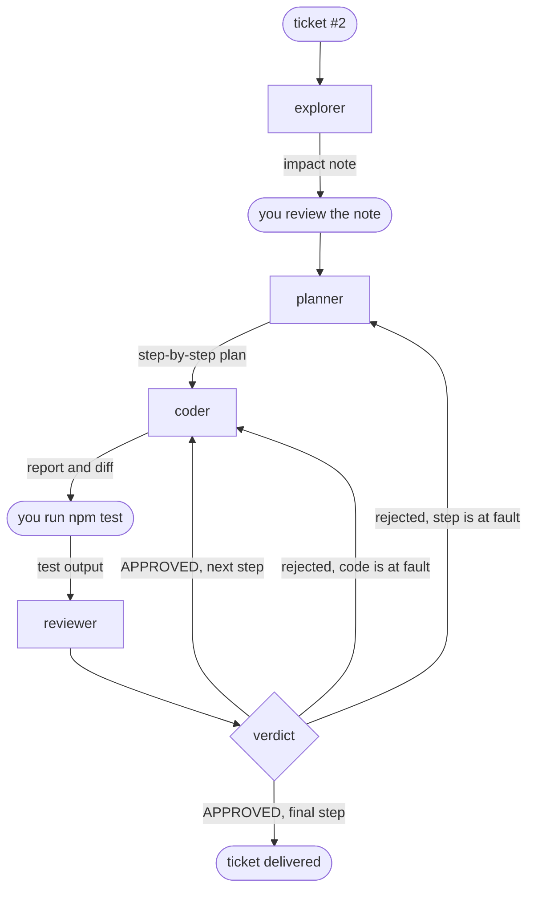

# Workflows: the loop written in a file

::: tip Objectives of this module
- Recognize in the previous module's loop the patterns of a workflow
- Write that loop in a file that Pi runs by itself
- Make tests the final judge, and choose where the human keeps control
- Adapt this file to your own needs in a few lines
:::

In the previous module, you were the orchestrator. You launched each agent with `/step`, reread the note, ran `npm test` in a second terminal, and after each verdict you decided who took over. That is instructive once. Doing these actions twenty times is far less so, and that is precisely the kind of repetitive task worth automating.

This module writes these actions into a file. combo calls this file a **flow**: a task graph described in YAML and markdown, placed next to your agents, and run by code rather than by a model. We will see that there is no language to learn and that your harness is modified like any configuration file.

We remind you that the combo tool was written specifically for this training and that it may not be advisable to use it in production today. That may no longer be the case in the long term. The idea is always to let you experiment quickly and easily.

## Understanding

### What is a workflow?

If we take a step back from the previous module, the steps we chained together form a graph. The rectangles are the subagents launched by `/step` and the rounded shapes are the actions you performed yourself:



This graph breaks down into a few patterns found in most multi-agent systems. Each figure shows in the top right corner how the pattern is written in a flow. Two patterns have their own node: fan-out and loop. The other three are simply nodes chained end to end.

- **chain**: the planner receives the explorer's note, the coder receives the plan.

  {.only-light}
  {.only-dark}

- **fan-out**: the explorer and the tester read the ticket at the same time, since neither of them writes.

  {.only-light}
  {.only-dark}

- **orchestrate**: the planner decides how many steps are needed, then each step goes to the coder.

  {.only-light}
  {.only-dark}

- **loop**: the coder and the reviewer start again until the step is validated.

  {.only-light}
  {.only-dark}

- **reduce**: an agent rereads the result of several branches and derives a single answer from it. In our loop, that is the auditor's role.

{.only-light}
  {.only-dark}

### A flow: your loop in a file

Let's see instead what this gives with combo on a concrete example, the explorer-then-planner chain:

```md
---
name: impact-plan
description: La note d'impact, puis le plan
input: string
nodes:
  - id: note
    agent: explorer
    reads: [input]
  - id: plan
    agent: planner
    reads: [input, note]
---

## note
Rends la note d'impact du ticket désigné sous `input`.

## plan
Découpe le ticket désigné sous `input` en petits pas, avec la note sous `note` comme carte.
```

The header describes the structure: the nodes, in order, and what each one reads. The body gives each agent its instructions, one `## <id>` section per node. Each agent receives its section and the items listed in `reads:`, nothing else. That is exactly what you were doing when you manually pasted the issue, the step, and the diff into the reviewer's message.

The entire file is validated before any model runs.

::: info Exercise (in class)
If you haven't already, install the combo extension

```bash
cd /chemin/vers/neon
pi install -l npm:@ai-for-dev/combo
pi
```

Add this file to `.pi/flows/impact-plan.md` and test it on issue #2. You can watch the agents progress in herdr.
:::

### Automating the orchestrator

In the previous session, you orchestrated the different steps involved in resolving a bug. Here, we will automate this process as follows:

| in the previous module                         | in the flow                                                                    |
| -------------------------------------------- | ------------------------------------------------------------------------------- |
| `/step explorer`, and test it alongside       | a `parallel` of two agents                                                    |
| the planner returns a plan in steps           | an `agent` whose output is a list of steps                                     |
| you give a step to the coder, then the next   | a `map` over that list, one step at a time                                     |
| you run `npm test`                            | a `check` that runs `.pi/checks/test.sh`                                       |
| the verdict, and the return to the coder      | a `loop` until the tests pass and the reviewer approves                        |
| the return to the planner                     | a second pass: the auditor re-reads everything and the planner replans what remains |
| `/chain` and your journal                     | the `runs/<timestamp>/` directory, with the trace of each agent                |

We saw in previous modules that it was important to carry out each step of a plan separately. You can ask combo to format the output. That is what we will do here, by asking it to produce a list of steps.

### Tests have the last word

We need a reliable step to know whether the changes made clearly meet our needs. We could ask for it in the prompt, but you've seen that you don't have 100% certainty that it will be done. We therefore prefer to define a bash script that represents the actions to take after each change. In a flow, the `check` node is precisely there to do this by launching a script from your project. Its result is a value that the loop reads: with `loop: tests.output.passed && review.output.approved`, the coder knows what it must do if the code it generated is wrong or if it doesn't strictly follow the development framework (linter for example).

{.only-light}
{.only-dark}

## Rebuilding

### The flow of ticket #2

Here is the loop from the previous module written in full. It uses your six agents without modifying them.

```md
---
name: issue2
description: Le tour de boucle du module précédent, de la note d'impact à l'audit
input: string
timeout: 15m

nodes:
  # Les deux lectures du ticket, en même temps : aucune des deux n'écrit.
  - id: survey
    parallel:
      impact:
        - id: note
          agent: explorer
          retry: 1
          reads: [input]
      cases:
        - id: cases
          agent: tester
          retry: 1
          reads: [input]

  # Le retour au planner : un second tour replanifie ce que l'audit a laissé ouvert.
  - id: round
    loop: suite.output.passed && audit.output.approved
    max: 2
    ledger: round
    do:
      - id: plan
        agent: planner
        retry: 1
        reads: [input, survey.output.impact.output, survey.output.cases.output, round.ledger]
        output: { steps: [{ text: string }] }

      # Un pas après l'autre, dans le même arbre.
      - id: steps
        map-from: plan.output.steps
        max: 6
        do:
          # Le retour au coder : jusqu'à trois essais par pas.
          - id: step
            loop: tests.output.passed && review.output.approved
            max: 3
            ledger: step
            on-fail: continue
            do:
              - id: code
                agent: coder
                retry: 1
                memory: step
                reads: [input, item.text, step.previous.tests, step.previous.review, step.ledger]

              - id: tests
                check: .pi/checks/test.sh

              - id: review
                agent: reviewer
                retry: 1
                memory: step
                verdict: step
                reads: [input, item.text, code, diff, tests]

      - id: suite
        check: .pi/checks/test.sh

      - id: audit
        agent: auditor
        retry: 1
        verdict: round
        reads: [input, steps, suite, diff, round.ledger]
---

## note
Rends la note d'impact du ticket désigné sous `input`.

## cases
Liste les cas de test dont le ticket désigné sous `input` a besoin, en disant
lesquels existent déjà. Commence par les comportements que l'extraction ne
doit pas changer.

## plan
Découpe le ticket désigné sous `input` en petits pas, avec la note d'impact et
le plan de tests comme carte. `remark` porte la remarque de la personne qui a
lancé le run, vide si elle n'en a pas fait. Quand `round.ledger` n'est pas
vide, c'est un second tour : ne planifie que ce que l'audit a soulevé et que
personne n'a fermé.

Le contrat est celui du ticket, pas le tien :

- la nouvelle fonction est `brickHit(ball, bricks)`, exportée de `game/neon.js` ;
- elle est pure : elle rend le tableau de toutes les briques vivantes que la
  balle chevauche, et ne modifie rien ;
- `frame()` se comporte exactement comme avant, y compris quand la balle
  chevauche plusieurs briques : chacune meurt dans la même frame, avec un
  incrément de combo chacune. Ce comportement est épinglé par un test avant de
  déplacer la logique, avec une balle de rayon 7 centrée dans l'espace entre
  deux briques voisines.

Le coder ne voit que le texte de son pas : nomme les fichiers, redis la partie
du contrat que le pas touche, et dis à quoi ressemble « fini ». Chaque pas
commence par son test rouge, écrit dans `game/neon.test.js`, et finit sur une
suite verte : le test rouge et le code qui le fait passer vont dans le même
pas, jamais dans deux.

## code
Exécute le pas décrit sous `item.text`, et lui seul.

Quand `step.previous.review` suit, le reviewer n'a pas approuvé ton dernier
changement : traite chaque remarque et chaque obligation de `step.ledger`, ou
dis clairement pourquoi tu ne le fais pas. `step.previous.tests` donne la
sortie de la suite après ce changement.

## review
Relis le changement fait pour le pas décrit sous `item.text`. Le rapport du
coder est sous `code`, le changement sous `diff`, la sortie de la suite sous
`tests`. Le rapport est une affirmation, le diff et le code sont la preuve.
Approuve, ou soulève ce qui doit encore changer.

## audit
Relis tout le changement sous `diff` contre le ticket désigné sous `input`.
`steps` dit comment la relecture de chaque pas s'est terminée : un pas qui n'a
pas convergé n'est pas fait tant que le code ne le montre pas. `suite` dit si
les tests du projet passent. `round.ledger` porte ce qu'un audit précédent a
soulevé et que personne n'a fermé.

Approuve le tout, ou soulève chaque correction sur sa propre ligne.
```

A few remarks on this flow

- The steps follow each other in the same tree, like your `/step`s.
- Three attempts per step and at most two rounds. A cap is required on every loop: without it, a model that never converges would keep running until the budget runs out. If your flow fails when it hits this limit, combo will tell you.
- The ticket contract is written in the planner section to make sure the user's requests are properly included. The exploration phase can obscure them.
- `retry: 1` on each agent. On the first real run of this flow, the planner wrote a very good plan, but in free text, without using the intended tool, and the run stopped. A second attempt, with the error named, was enough.
- Each step ends on a green suite. Another run planned a "write the red tests" step on its own, without the code. The loop requires a green suite, so that step could not succeed and it used up its three attempts. When a loop does not converge, first check whether its condition was reachable.

Two roles are added here. The tester (`scripts/agents/tester.md`) checks whether tests exist and whether more are needed. The auditor (`scripts/agents/auditor.md`) ensures the work is completed in full and nothing has been forgotten, while the reviewer only sees one step. What it raises stays open until someone addresses it, and the flow starts a second round.

::: warning  A note on these choices
We remind you that the objective of this training is to give you all the elements needed to build your harness. The choices made here are therefore debatable and perhaps not optimal for getting the best results. But you have all the understanding required to remove nodes, add new ones, or modify them.
:::

::: info Exercise (in class)
Place the agents, the flow, and the test script in your NÉON clone:

```bash
cd /chemin/vers/neon
mkdir -p .pi/agents .pi/flows .pi/checks
cp /chemin/vers/hands-on-harness/scripts/agents/*.md .pi/agents/
# Collez le flow ci-dessus dans .pi/flows/issue2.md
printf '#!/usr/bin/env bash\nnpm test\n' > .pi/checks/test.sh

printf '.pi/\nruns/\n' >> .gitignore
git add .gitignore && git commit -m "ignorer .pi et runs"

pi install -l git:github.com/AI-for-dev/combo
pi
```

On first launch, Pi asks whether you trust the project folder: without this, it loads neither `.pi/` nor combo. Choose "Trust".

Check what Pi loaded before launching anything:

```prompt
/flows
/flows issue2
```

The first command lists the flows found, the second displays the plan of `issue2` node by node. Then break the file on purpose by replacing `agent: coder` with `agent: codeur`, rerun `/flows`, and read the refusal: it names the node and suggests the correct name. Put `coder` back, then run the loop:

```prompt
/run issue2 traite le ticket #2 d'ISSUES.md
```

Pi draws the flow above the prompt as it progresses. The remark card appears after the impact note; then everything you used to do by hand now runs without you.

At the end, do your own checks, the ones from the previous module: `npm test`, the exports list, `git diff`, and the trace in `runs/<horodatage>/`. Don't settle for the flow's verdict.
:::

An interrupted run resumes with `/run resume`, where it stopped.

### Adapt the harness to your needs

This flow is a starting point. Each modification that follows only takes a few lines, and `/flows issue2` tells you before any run whether it is valid.

The flow stops at the audit, and committing is left to you. To have it propose the commit, add a question, a branch, and the commit at the end:

{.only-light}
{.only-dark}

```yaml
  - id: go
    ask: "Commiter ce changement ?"
    confirm: true
    default: false
    reads: [diff]

  - id: ship
    choice:
      - when: go.output.yes
        do:
          - id: message
            agent: committer
            reads: [input, diff]
          - id: commit
            commit: message
    default: []
```

Add a `## message` section that tells the committer what to write. The `committer` ships with combo, the commit goes to a branch dedicated to the run, and nothing is pushed. With `default: false`, a run with no one at the screen does not commit.

A flow that works also becomes a building block. A `flow` node calls another flow in its entirety: your `issue2` can be used in a larger flow without being copied.

{.only-light}
{.only-dark}

```md
---
name: ticket
description: Le flow issue2 comme une brique, puis le commit
input: string
nodes:
  - id: work
    flow: issue2
    input: input

  - id: message
    agent: committer
    retry: 1
    reads: [input, diff]

  - id: commit
    commit: message
---

## message
Écris le message de commit du changement sous `diff`, fait pour la demande sous `input`.
```

The rest follows the same logic. A larger model for the planner and the auditor is set in their agent files. An audit that adds nothing on a small ticket is removed by deleting its node and simplifying the loop condition. Independent steps can run in parallel, each in its own copy of the repository (`concurrency: 2` and `copies: true` on the `map`).

::: info Exercise (on your own)
Add the stop before the commit and replay the ticket. Then try a modification of your own: a different split of the roles, a larger model where you judge it useful, a flow for another type of ticket. The question to ask yourself is always the same: what gesture were you repeating by hand, and which line would write it?
:::

### What about the measurement? (To do with trysquare)


## Generalizing

Automating a loop requires having run it by hand or analyzing the traces closely. The flow in this module is your journal from the previous module, rewritten: each line answers a decision you made yourself, and that is why you know where to put it.

The harness is built through successive corrections. Each failure read in the trace becomes a modification to the flow.

Tests have the final say, but they only check what they constrain. A green suite does not prove the ticket is done.

A decision deserves its own channel. As long as a verdict is read from prose, it depends on how the model writes a word such as `APPROVED`. When possible, give it a tool to answer. You can rely on https://laya.convaiinnovations.com/ , which allows much finer decisions than a classic LLM.

Human stops are design choices. Place them where an error costs more to undo than to prevent, and nowhere else. In our case, a Q&A discussion on the ticket to enrich the plan could be a good thing.

## Deliverable

This module produces three pieces.

1. Your flow `.pi/flows/issue2.md` and the script `.pi/checks/test.sh`, versioned with your agents, in the version you adapted.
2. The trace of a complete run, the `runs/<timestamp>/` directory from a `/run issue2` on ticket #2.
3. The "workflows" line of the decision sheet, below.

::: tip Success criterion
With the trace in hand, you can explain why a run succeeded or failed: which step did not converge, whether the suite was red, what the auditor left open. You can evolve your workflow to try to obtain a harness that follows your way of working and be confident in the result.
:::


## Going further

- Anthropic, [Building Effective Agents](https://www.anthropic.com/engineering/building-effective-agents), the distinction between workflows and agents, and the patterns of this module in their general form.
- [The combo documentation](https://github.com/AI-for-dev/combo/tree/main/docs), in particular the page on flows and the `build` and `build-attended` flows shipped with combo, which do more generically what this module does on a ticket.
- [herdr](https://herdr.dev), to watch a flow work, one panel per agent.
