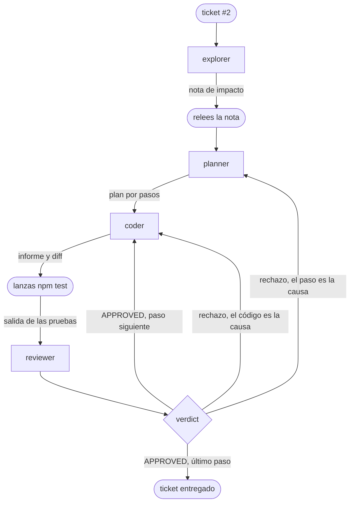

# Los workflows: el bucle escrito en código

::: tip Objectivos de este módulo
- Situar las tres formas de una misma secuencia: la cadena recorrida a mano, el pipeline escrito en un archivo, el workflow escrito en código
- Componer los roles del módulo anterior con los combinadores de combo: cadena, fan-out, bucle, entrega
- Escribir un pipeline: la estructura en el frontmatter, la prosa por paso, y lo que un archivo no puede expresar
- Establecer un gate ejecutable cuyo veredicto prevalezca sobre todas las aprobaciones
- Leer un resultado de workflow: `ok`, `converged` y las cuatro condiciones que `approved` agrega
- Reejecutar el ticket #2 de principio a fin, sin intervención entre el brief y el veredicto, y saber demostrar el mecanismo sin modelo
:::

El módulo anterior te permitió experimentar de primera mano qué es un orquestador y cuál es su función en la automatización de las tareas de tu harness. El comando `/step` te facilitó el trabajo; no dudes en descomponer de nuevo si quieres probar nuevos flujos de trabajo. La secuencia se revisa con `/chain`, y cada paso deja su rastro en el disco en un directorio dedicado, lo que te permite ver y comprender las interacciones entre los agentes.

Este módulo escribe la secuencia por ti en un archivo que describe el flujo de trabajo. Seguimos utilizando combo, que nos permite escribir este flujo de trabajo en un archivo Markdown con un encabezado YAML que describe sus pasos. Podrás modificarlo a tu conveniencia.

## Comprender

### ¿Qué es un flujo de trabajo?

En el módulo anterior, encadenamos los pasos progresivamente, pero si tomamos un poco de perspectiva, podemos reproducir fácilmente nuestros pasos en forma de un grafo, donde los rectángulos son los subagentes lanzados por `/step` y las formas redondeadas son las acciones que realizabas tú mismo:



Existen diferentes nodos en un flujo de trabajo:

- fan-out

  {.only-light}
  {.only-dark}

- chain

  {.only-light}
  {.only-dark}

- orchestrate

  {.only-light}
  {.only-dark}

- loop

  {.only-light}
  {.only-dark}

- reduce

  {.only-light}
  {.only-dark}

En combo, un workflow es una función de una entrada hacia un `Result`, o una lista de `Result`: el nombre del agente que se ejecutó, su texto final, sus mensajes, su consumo, un campo `ok` que indica si el turno se ejecutó sin errores del modelo, y la razón cuando no fue así. Los **combinadores** de combo, las funciones que toman agentes y devuelven un workflow, componen porque comparten este contrato. Los agentes siguen siendo los archivos markdown del módulo anterior, y la orquestación es código: no hay ningún lenguaje de descripción que aprender. Queríamos que la escritura de un workflow siguiera siendo fácil de leer y comprender.

Diez combinadores cubren las formas útiles:

| combinador    | forma                                                                |
| ------------- | -------------------------------------------------------------------- |
| `chain`       | 1 → 1 → 1, la salida de un paso alimenta al siguiente               |
| `fanOut`      | 1 → N ramas en paralelo, un agente para todas o uno por rama        |
| `swarm`       | N miembros con un único objetivo, un tablero entre ellos, nadie divide |
| `loop`        | 1 → 1 hasta una meta (`until`), techo de iteraciones               |
| `reduce`      | N → 1, un agente sintetiza las ramas                                |
| `route`       | un clasificador elige el destino                                   |
| `orchestrate` | un agente decide la división, plan validado antes de cualquier lanzamiento |
| `pair`        | un trabajador y un revisor, hasta el acuerdo                        |
| `interview`   | el agente cuestiona al usuario, una pregunta a la vez              |
| `deliver`     | plan, un par por subtarea, verificación del proyecto, auditoría, correcciones |

Dos de ellos no pueden nombrarse en un pipeline: `interview` se dirige al usuario, lo que no tiene sentido en una secuencia que se supone debe ejecutarse sola, y `swarm` necesita un tablero compartido que el formato de archivo no sabe describir. Un pipeline nombra, por tanto, ocho.

Tres campos del resultado responden a tres preguntas diferentes, y confundirlos es la primera fuente de lectura errónea de un informe. `ok` indica que los turnos se ejecutaron sin errores del proveedor. `converged`, en un `loop`, indica que el trabajo alcanzó la meta solicitada en lugar de agotar su techo de iteraciones. `approved`, en un `pair` o un `deliver`, no es la firma de alguien sino una conjunción de cuatro condiciones, y es el campo cuyo nombre es más engañoso; la sección que sigue al gate lo detalla. Alcanzar un techo no es un éxito, y la lectura de un informe comienza, por tanto, por distinguir estos tres campos.

Un fallo, por otro lado, no hace que el workflow colapse. Una rama de fan-out que falla se convierte en un `Result` con `ok: false` en su lugar y las demás continúan. Y un subagente que ha consumido doce mil tokens antes de fallar ha costado doce mil tokens: su consumo se contabiliza incluso cuando `ok` es falso.

::: warning Un bucle de agente no tiene un límite propio
Un turno es un `session.prompt()`, y el bucle de agente de Pi gira mientras el modelo solicite herramientas. Un modelo débil que alucine un nombre de herramienta, reciba « unknown tool » y vuelva a solicitarlo, entrará en bucle hasta que algo lo detenga: la documentación de combo reporta 79 llamadas a una herramienta inexistente y unos 500 000 tokens de entrada en un solo turno.

`maxIterations` tiene un valor por defecto (5), porque una iteración es una unidad discreta y costosa. `timeoutMs` no lo tiene, porque ningún valor por defecto puede decidir que una tarea legítima ha tardado demasiado. Pon, por tanto, un `timeoutMs` en todo lo que se ejecute sin supervisión: el olvido de un argumento no debe bastar para hacer posible un bucle infinito.
:::

### El pipeline: la parte lineal, en Markdown

Una secuencia lineal de combinadores puede escribirse en un archivo en lugar de en código. Es un **pipeline**, ubicado en `.pi/pipelines/` junto a los agentes. El frontmatter contiene la estructura, es decir, las etapas, sus agentes, sus límites y el check del proyecto, porque es YAML real y la anidación allí es natural; el cuerpo contiene la prosa, una sección `## <id>` por etapa. Ningún agente lee este archivo para decidir el siguiente paso, ya que es el código de combo el que lo ejecuta.

Los pipelines siguen los mismos alcances que los agentes (entregados, máquina, repositorio), prevaleciendo el más cercano al trabajo, y la misma barrera de seguridad: los de un repositorio nunca se cargan por defecto. El régimen de fallo difiere, en cambio, del de los agentes, y esta diferencia corrige una trampa del módulo anterior. Un archivo de agente incompleto se ignora silenciosamente, mientras que un pipeline malformado es rechazado, nunca reemplazado sin aviso por el valor por defecto. Un agente se descubre, mientras que un pipeline se solicita por su nombre, por lo que un archivo presente pero ilegible debe notificarse con su motivo en lugar de ignorarse.

Todo se valida antes de abrir la mínima sesión: la forma de cada etapa, la correspondencia entre las entradas del frontmatter y las secciones del cuerpo en ambos sentidos, y cada nombre de agente contra el roster. Una errata en la etapa cuatro cuesta así un segundo en lugar de tres etapas de trabajo real.

El límite está establecido de antemano y es deliberado: un pipeline no tiene condiciones, ni ramas, ni referencias al paso dos. Cada paso recibe su instrucción, la solicitud inicial y la salida del paso anterior, nada más. En el momento en que una ejecución necesita una bifurcación, se convierte en un workflow en TypeScript, lo que mantiene la regla «los agentes son datos, los workflows son código» sin prohibirte escribir la parte lineal en Markdown.

### El gate: la suite de pruebas como veredicto

`deliver` acepta una verificación, y la documentación de combo relata la ejecución que la impuso: un compañero escribió una función y sus pruebas, el revisor aprobó, el auditor aprobó, y el archivo de prueba importaba `./slugify.js` para un archivo llamado `slugify.ts`. La suite ni siquiera se cargaba, porque los dos agentes habían leído el código sin llegar a ejecutarlo.

El mecanismo es un **puerto**: el pipeline nombra el check (`verify: [npm, test]`), y es el código llamador el que lo ejecuta, mediante `execFile` y sin shell. Los argumentos son una lista, de modo que `"npm test && rm -rf /"` sigue siendo un único argumento y nunca dos comandos. La salida se trunca por el final en lugar de por el principio, porque un ejecutor de pruebas indica al final qué es lo que falló. Y cuando un check está configurado, su veredicto es final: ninguna aprobación, de ningún agente, transforma un check rojo en éxito.

### El veredicto: una llamada a herramienta en lugar de una palabra

Un revisor escribe para un humano y emite un veredicto para un programa, y durante mucho tiempo combo extrajo el segundo del primero buscando una palabra en la prosa. El régimen de fallo de esta lectura está documentado mediante dos mediciones sucesivas. La comparación se hacía primero por inclusión, por lo que una revisión que escribía «aún no puedo decir LGTM» hacía que el bucle convergiera en lo contrario. La regla de la línea completa corrigió este caso preciso, pero sigue basándose en una convención que un modelo puede ignorar, y la formación ya ha medido cuánto vale una instrucción que no es obligatoria.

La respuesta de combo es extraer la decisión del texto. Un agente que declara `verdict` en sus herramientas recibe una herramienta para emitirla, y su prosa vuelve a ser lo que es: el argumento junto a la decisión, en lugar del soporte de la misma. La palabra sobrevive como alternativa para los agentes a los que nadie ha ofrecido la herramienta, porque un revisor debe poder decir que sí incluso sin herramienta, pero ya no es el camino normal. Es exactamente el mismo arbitraje del módulo anterior entre prohibir y retirar, aplicado al veredicto: cuando dudes entre pedir una palabra y proporcionar un canal, proporciona el canal.

Un canal limpio no corrige un juicio falso, sin embargo, combo pagó la lección en el mismo run que entregó la herramienta: el revisor llamó a `verdict` correctamente y aprobó una función que calculaba `a - b` anunciando una suma. De ahí la segunda pieza, el **ledger**. Lo que el auditor señala recibe un identificador y lo guarda, y el agente responde después a una pregunta cerrada mediante el identificador en lugar de reescribir sus observaciones, de modo que « ¿es la misma observación que la del turno anterior? » deja de ser una adivinanza. Tres reglas son código más que prosa: solo quien abre una obligación puede cerrarla, nada se reescribe y una obligación que nadie menciona permanece abierta. Esta última es la más importante, porque un modelo que olvida no ha aprobado, y fallar estando cerrado es el único defecto que no se puede revertir con palabras.

::: info La palabra de acuerdo y el idioma de trabajo
Una consecuencia directa para una formación que trabaja en español. Las definiciones de agentes están en inglés, pero cada sub-agente de combo recibe la instrucción de responder en el idioma de trabajo que se le asigne, de modo que un ticket en español regresa comentado en español. La instrucción no menciona ningún idioma, porque una versión anterior ilustraba su regla con un ejemplo en español y hacía que se respondiera en español a la pregunta siguiente, formulada en inglés.

La palabra de acuerdo es precisamente lo que no debe seguir esta regla: un modelo al que se le pide español escribe `LISTO` por `READY` y `SIN NOVEDADES` por `LGTM`, y traduce de paso una clave JSON que un parseur lee por su nombre. La instrucción establece, por tanto, la excepción por la forma más que por la lista: todo lo que se te haya pedido responder exactamente regresa tal cual. Es una convención más que depende de la buena voluntad del modelo, y una razón más para preferir la herramienta.
:::

### Las cuatro condiciones de `approved`

`approved`, en una entrega, es verdadero cuando estas cuatro cosas son ciertas a la vez: el auditor ha firmado, ninguna de las obligaciones que ha señalado permanece abierta, el check no está en rojo y cada corrección ha llegado al árbol de trabajo. Cada una responde a una forma distinta de equivocarse, y cada una fue añadida tras una ejecución que había engañado a las anteriores.

La cuarta requiere una explicación, porque proviene de un cambio de diseño. Dos sub-agentes que comparten un directorio se leen entre sí: cuatro de ellos, colocados en la misma carpeta y solicitando únicamente escribir un archivo y decir qué veían, leyeron cada uno los archivos de los otros tres en un solo turno sin que se les pidiera. El ajuste por defecto ha cambiado, por lo que una entrega de más de una subtarea otorga ahora a cada par su propia copia del repositorio. Estas copias deben regresar, y una corrección que nunca ha llegado al árbol no está entregada, independientemente de lo que el auditor haya pensado del informe que la describe.

Lo que estas cuatro condiciones no contienen se lee tan bien como lo que contienen: **el acuerdo del par no está allí**. Un revisor par que agote sus turnos sin firmar nunca se refleja en el informe, subtarea por subtarea, y no bloquea nada. Si tu política exige su acuerdo, esta se escribe en el código llamador, y la versión de script de este módulo lo hace.

::: warning El aislamiento se decide antes del trabajo, en un árbol limpio
Una entrega que elige por sí misma distribuir copias verifica primero que estas puedan volver, y rechaza cualquier árbol de trabajo que ya tenga la menor modificación, incluso un simple archivo no seguido. El rechazo ocurre antes de la primera sesión, que es el lugar correcto, pero sorprende la primera vez:

```
2 subtasks need a copy of the repository each, and refusing to land onto a
tree that already has changes in it
```

Depositar tus agentes en `.pi/` basta para activarlo. Haz commit de este directorio, ignóralo, o establece `worktree: false` para que las subtareas compartan un árbol como antes.
:::

## Reconstruir

### Qué cambió el enlace en los roles

Enlazar los agentes del módulo anterior a `deliver` hizo aparecer dos colisiones de convención, que responden al mismo principio: la forma del entregable pertenece al llamador.

La primera afecta al planner. `deliver` le envía su propia solicitud de plan, un arreglo JSON `[{"agent": …, "task": …}]`, y lee la respuesta con un analizador permisivo con la forma y estricto con el fondo, ya que un nombre de agente desconocido es descartado en lugar de ser reemplazado por uno vecino plausible. El plan «para humanos» del módulo anterior, con sus `files:` y sus `done:`, no contiene nada que este analizador sepa leer: hemos reproducido esta respuesta contra el analizador real, y la entrega se detiene antes de abrir la menor sesión, con un `no runnable plan`.

La corrección consiste en una regla añadida al planner: la forma por defecto sirve al orquestador humano, y cuando el llamador especifica la forma de respuesta que sabe leer, es esa la que se aplica, porque un plan que el llamador no puede analizar no planifica nada. Las reglas de fondo, el tamaño de los pasos, el test rojo primero, la API congelada, se mantienen independientemente de la forma.

La segunda colisión afecta al reviewer, y se corrige de dos formas que no son equivalentes. Bajo `pair`, la palabra de acuerdo es `LGTM`, sola en su línea, mientras que nuestro reviewer del módulo anterior dice `APPROVED`: un revisor que pronuncie la palabra del otro nunca es contado como un acuerdo, por lo que el par agota sus turnos y devuelve `approved: false` en un trabajo que nadie ha rechazado.

La primera corrección fue una frase añadida al archivo: "adopta el modo de acuerdo de quien te llama". Funciona, pero es mala por la razón que el módulo sobre competencias cuantificó: una instrucción no obliga a nada, y esta pide al modelo que adivine con quién habla. La corrección adecuada es añadir `verdict` al conjunto de herramientas de los dos revisores, lo que les da un canal para la decisión y deja sin efecto la cuestión de la palabra. Mantenemos ambas en el repositorio: el conjunto de herramientas porque es lo necesario, y la frase porque un agente siempre puede ser llamado por un código que no ofrezca la herramienta.

Se añade un rol: el auditor. El revisor de pares ve una subtarea, mientras que el auditor lee todo el resultado final y busca lo que la suma de las piezas ha olvidado: un paso del plan que nadie hizo, o un requisito del ticket que ninguna subtarea contemplaba. Es la versión "global" de las verificaciones que el revisor del módulo anterior hacía paso a paso. Él también dispone de `verdict`, y lo que escriba en `raised` se convierte en la lista de obligaciones que el ledger mantiene: cada línea recibe un identificador, y la entrega no termina hasta que quede una sola abierta.

<<<@/../scripts/agents/auditor.md{md}

### El pipeline del ticket #2

<<<@/../scripts/pipelines/issue2.md{md}

Cinco decisiones de este archivo requieren una justificación.

El fan-out del módulo anterior se escribe en el archivo: dos agentes, uno por rama, con tareas literales. Un fan-out cuyas ramas vinieran del paso anterior sería otro combinador, `orchestrate`, donde un agente decide el desglose, y mantener las tareas literales evita que el formato necesite una sintaxis de plantilla.

`verify: [npm, test]` se declara una vez, al principio. Es el gate, que el pipeline nombra sin ejecutarlo, ya que la ejecución corresponde al código que posee el árbol de trabajo.

`maxTasks: 2` y `concurrency: 1` en la entrega, porque el trabajo del ticket #2 es secuencial: cabe en una subtarea en lugar de tres, y dos coders lanzados juntos en pasos encadenados pasarían el tiempo esperándose. La razón que se dio hace poco, las escrituras cruzadas de dos trabajadores en un mismo árbol, ya no lo es: más allá de una subtarea, combo distribuye una copia del repositorio por pareja y recupera los correctivos uno por uno. El límite sigue siendo útil, aunque su justificación ha cambiado.

`maxAuditRounds: 3` en lugar de 2, porque una auditoría que prescribe un correctivo consume un turno, el correctivo otro, y hace falta un turno restante para firmar. Con 2, una ejecución cuya segunda auditoría pedía un retoque terminó en `approved: false` en un árbol que, sin embargo, estaba verde y era conforme.

La prosa del paso `work`, finalmente, establece el contrato del entregable, es decir, la firma exacta, la pureza, el formato del retorno y el comportamiento de `frame()` cuando la bola abarca varios bloques. Cada libertad que la solicitud deja abierta se convierte en una variante de un run a otro: antes de este bloque, seis runs en este ticket produjeron tres firmas diferentes, incluyendo una que solo rompía un bloque por frame sin que ningún test se pusiera en rojo. La misma prosa impone el test rojo primero en la suite, que es la regla del planner repetida en el lugar donde se fabrica el plan.

::: info Ejercicio (en sala)
Coloca el pipeline junto a los agentes, luego verifica lo que Pi ha cargado realmente antes de lanzar nada:

```bash
cd /chemin/vers/neon
mkdir -p .pi/pipelines .pi/agents
cp /chemin/vers/hands-on-harness/scripts/pipelines/issue2.md .pi/pipelines/
cp /chemin/vers/hands-on-harness/scripts/agents/*.md .pi/agents/

# Sans quoi la livraison refusera de distribuer des copies du dépôt : un `.pi/`
# non suivi est une modification de l'arbre comme une autre.
printf '.pi/\nruns/\n' >> .gitignore
git add .gitignore && git commit -m "ignorer .pi et runs"

pi install -l npm:@ai-for-dev/combo
pi
```

```prompt
/pipelines
```

El comando enumera los pipelines cargados, el formato de cada ejecución y los archivos que no parsean con su motivo. Rompe deliberadamente el YAML del frontmatter, ejecuta `/pipelines` de nuevo y observa el comportamiento ante fallos: el archivo es rechazado y nombrado con su motivo, en lugar de ser reemplazado en silencio.

Luego lanza el bucle:

```prompt
/build --pipeline issue2 --model ilaas/gemma-4-31b traite le ticket #2 d'ISSUES.md
```

`/build` se detiene exactamente dos veces: en el brief antes de cualquier trabajo y en el commit al final. Entre ambos, todo lo que hacías a mano en el módulo anterior se encadena sin ti: la nota de impacto, el plan, la pareja coder-reviewer, `npm test`, la auditoría, las correcciones. Rechazar una de las dos detenciones no deshace nada, el trabajo permanece en el árbol. Al final, realiza tus propias verificaciones, las del módulo anterior: `npm test`, la lista de exports, `git diff` y el trazo completo en `runs/<timestamp>/`.
:::

Un run interrumpido se reanuda con `/build resume`: solo se conservan las subtareas aprobadas, el plan se reutiliza en lugar de rehacerse y nada de la conversación regresa, por lo que un build reanudado vuelve a leer el código en lugar de reproducir una transcripción.

### La prueba de mecanismo, sin modelo

Antes de gastar un solo token, el mecanismo completo se verifica en vacío y el protocolo se reutiliza en cualquier workflow: el código real de combo (parseur, `runPipeline`, `deliver`, ledger), el `npm test` real de NÉON como gate, y un modelo falso inyectado por el puerto `spawn`, cuyo coder aplica el diff de referencia del ticket #2. Solo el modelo está simulado; todo lo que lo rodea es el código real. Se trata de `scripts/workflows/issue2-smoke.mjs`, que se ejecuta en un clon desechable que contiene los agentes y el pipeline:

```bash
node scripts/workflows/issue2-smoke.mjs /chemin/vers/neon /chemin/vers/combo
```

Y aquí está su salida:

```
S1 parse+resolve            OK   note(fanOut) -> work(deliver)
S2 chemin vert              OK   approved=true, npm test: 9 cas verts
S3 gate                     OK   verdict pair + audit favorables, check rouge => approved=false
S4 ledger                   OK   check vert + audit favorable, 1 obligation ouverte => approved=false
S5 plan au format humain    OK   'no runnable plan' - la forme appartient à l'appelant
S6 mot d'accord sans outil  OK   pair jamais approuvé ; le tout reste sauvé par audit + check
```

Cada línea verifica una propiedad. S1: el archivo parsea y cada nombre se resuelve antes de cualquier sesión. S2: con el diff de referencia, la suite pasa de 6 a 9 casos, los dos revisores llaman a `verdict` y la entrega es aprobada.

S3 y S4 son las dos demostraciones centrales, porque muestran las dos formas en que una firma no es suficiente. En S3, el mismo diff contiene una prueba sabotajeada: el par aprueba, la auditoría aprueba, y `approved` sigue siendo falso porque el check está en rojo. En S4, el árbol está en verde y el auditor firma, pero había planteado una obligación en el turno anterior y nunca la cerró, por lo que `approved` sigue siendo falso también allí. Un veredicto ejecutable gana a una aprobación, y una obligación olvidada gana a la firma de quien la había abierto.

S5 y S6 recrean las dos colisiones de convención descritas anteriormente, y demuestran que fallan donde deben: antes del trabajo para el plan y en el par para el veredicto. S6 requiere una precisión: retira deliberadamente la herramienta `verdict` al reviewer para ejecutar el régimen de repliegue, ya que nuestros agentes ahora la llevan y la trampa de la palabra ya no se activa por defecto. Es la prueba de que el canal soluciona el problema, obtenida al desconectarlo.

::: warning Lo que `approved` agrega
S6 muestra la sutileza de diseño que debes conocer antes de leer un informe de `deliver`: un par que agota sus turnos sin acuerdo no es un veto. Su propio `approved` sigue siendo falso y se lee en el informe, subtarea por subtarea, pero no figura en ninguna de las cuatro condiciones del veredicto final. En S6, el trabajo estaba hecho desde el primer turno, la auditoría y lo siguiente lo confirmaron, y la entrega está aprobada aunque ningún revisor de pares haya dicho la palabra correcta: el veredicto se basa en el check, en la lectura del conjunto y en las obligaciones cerradas, no en el acuerdo de cada nivel. Si tu política exige el acuerdo del par, se escribe en el código llamador, y la versión script de este módulo lo hace en las dos líneas que preceden a su código de salida.
:::

Esta prueba no dice nada de lo que un modelo real hará en el rol de planner o de coder en este ticket. Establece que si el modelo hace el trabajo, el harness lo dejará pasar, y que si lo hace mal, el gate lo detendrá. El comportamiento del modelo, por su parte, solo se establece mediante la medición.

::: warning Un check verde no dice que el ticket esté terminado
S3 establece que una aprobación no gana a un veredicto rojo, y lo recíproco es falso. Una ejecución real de este pipeline lo demostró: `check: verde`, `approved: true`, doce casos verdes, y en el árbol una función `export function brickHit(state)` que muta el estado, donde el ticket pide `brickHit(ball, bricks)`, pura. El auditor había prescrito el cambio de firma, el revisor lo había dejado pasar, y lo siguiente lo validó porque ninguna prueba restringe la firma solicitada.

Este run concreto saldría mejor hoy, y vale la pena decir por qué: la prescripción del auditor se convertiría en una obligación con un identificador, y la entrega se negaría a declararse finalizada hasta que alguien la cerrara. El ledger nació de esta clase de fallos. Pero no desplaza el límite, lo desplaza un escalón: obliga a alguien a responder a la observación, no a tener razón.

Un gate solo verifica lo que la suite constriñe. `approved` significa «el auditor ha firmado, sus reservas han sido levantadas, el check está en verde y las correcciones están en el árbol», nunca «el ticket está satisfecho», y lo único que une ambas cosas es un test que alguien ha escrito específicamente. Esto es también lo que justifica la etapa `tester` del fan-out: un plan de tests que nombra la firma esperada transforma un requisito de prosa en un requisito ejecutable.
:::

### La comparación que queda por medir

El módulo anterior dejó una pregunta de medición abierta: ¿mejora el desglose por roles el resultado en el ticket #2, frente a un agente solo que reciba el mismo brief? Este módulo establece el protocolo sin publicar cifras y, como en el resto de la formación, la hipótesis se escribe antes de la medición.

La pregunta se divide en dos, y hacen falta dos bancos de pruebas porque ninguno de los dos sabe responder al otro.

El primer banco es `experiment`, en combo. Rejuega el mismo workflow en M modelos y N repeticiones, cada célula en su repositorio con sus mediciones, y devuelve una tabla cuyas columnas de banderas son lo que tu función retorna (`approved`, la suite en verde, los exports intactos). Dos variantes bastan: el bucle de este módulo y un `run` único del coder con el ticket delimitado. Es el único banco que puede comparar **este pipeline** con un agente solo, ya que es el único que sabe lanzar un pipeline.

El segundo es el banco de trabajo trysquare de la formación, y responde a la pregunta vecina: ¿qué valor tiene el desglose por roles cuando es **el agente** quien lleva el mando? El escenario `issue2-delegation` está en el repositorio, con su hipótesis escrita antes de la medición. Dos células, una sola palanca: el mismo brief, más los seis roles en `.pi/agents/` y la herramienta para llamarlos. Su criterio es `multi_briques`, es decir, el comportamiento que el ticket no nombra, porque la firma que el ticket nombra mide la obediencia y se satura.

La diferencia entre los dos bancos no es un detalle de herramientas, es la pregunta del módulo replanteada: en un caso, la secuencia es código que ningún modelo reinterpreta; en el otro, es el modelo el que decide delegar y a quién. Si las dos tablas divergen, la divergencia es el resultado.

::: info Ejercicio (en autonomía)
Escribe primero la hipótesis: ¿qué predices sobre la división en el desbordamiento y en qué condición dirías que no aporta nada? La del banco de trabajo ya está escrita, `hypotheses/issue2-delegation.md`, y predice que la división no aporta nada decisivo en este ticket, porque el comportamiento a preservar cabe en diez líneas que la ventana de un solo agente contiene sin problema. Contradícela si no crees en ella, pero escribe la tuya antes de empezar.

Escribe después la función `experiment` que ponga la tuya a prueba, con veinte repeticiones por variante. La lección del módulo sobre el contexto se aplica sin cambios: tres repeticiones muestran la dispersión y no definen un ganador.
:::

## Generalizar

Los agentes son datos, los workflows son código. Un archivo describe un rol, el código describe una secuencia, y la frontera entre ambos es un contrato: la parte lineal puede volver a ser un archivo, la primera condición hace que regrese al código. Un sistema que organiza la orquestación en un lenguaje de configuración termina reinventando en él un lenguaje de programación, sin las herramientas correspondientes.

Un veredicto ejecutable supera cualquier aprobación. Dos agentes aprobaron una prueba que no se cargaba, y un check lo habría dicho en un solo comando. El veredicto del gate es el único que no es una opinión, y es final por construcción.

`ok`, `converged` y `approved` responden a tres preguntas diferentes. Que haya turnos girando no significa que se haya alcanzado la meta, un límite agotado no es un éxito, y lo que el veredicto final agrega se lee en el código más que en su nombre, como demuestra S6.

Una decisión merece su propio canal. Mientras el veredicto de un revisor se lea en su prosa, la cadena depende de un acuerdo sobre cómo escribir una palabra, y ese acuerdo se rompe en silencio: el bucle agota sus turnos y devuelve un rechazo que nadie ha pronunciado. Una herramienta transporta la decisión como un evento con un esquema, de modo que «¿ha decidido?» y «¿qué ha decidido?» vuelven a ser dos preguntas cerradas. Cada vez que extraigas un valor de un texto escrito para un humano, pregúntate si el emisor no podría dártelo directamente.

Una lista que mantiene el código supera a una lista que recuerda el modelo. El ledger no hace que el auditor sea más justo, le impide olvidar: un identificador por obligación, solo quien abre puede cerrar, y lo que nadie menciona permanece abierto. Esta última opción es el único fallo que no se soluciona hablando, y es la regla general a recordar: fallar cerrado cuando la memoria del modelo es lo único que te falta.

La forma del entregable pertenece al llamador. El mismo planner sirve tanto a un humano como a un parseur, siempre que se indique en su prompt a quién pertenece la forma. Esta colisión se corrige con una frase, porque los roles y los formatos estaban separados desde la escritura; la del reviewer se corrigió con un conjunto, lo cual es mejor, y la diferencia entre ambos remedios es exactamente la diferencia entre pedir y garantizar.

Toda verificación que pueda desplazarse antes del primer gasto debe desplazarse. El pipeline se parsea, sus secciones se emparejan, sus agentes se resuelven y su plan se delimita antes de la primera sesión, de modo que una errata cuesta un segundo en lugar de tres etapas de trabajo real. La regla se transpone a cualquier secuencia que pague cada etapa.

Los límites sin valor predeterminado se establecen a mano. El límite de iteraciones tiene un valor predeterminado porque la unidad es discreta y costosa; el plazo no lo tiene porque sería arbitrario, por lo tanto, te corresponde a ti establecerlo en todo lo que funcione sin supervisión. Busca, en cada herramienta, qué permite el olvido de un argumento.

El mecanismo se verifica sin modelo. Un puerto de inyección, el `spawn` de combo, separa el harness del modelo: la prueba en blanco establece que el harness enruta, filtra y rechaza según lo previsto, en un segundo y por cero tokens, mientras que lo que el modelo haga con el rol sigue siendo una cuestión de matriz. Confundir ambos hace pagar repeticiones para verificar código, o hace creer probado lo que solo era plausible.

Las paradas de un harness autónomo son decisiones de diseño. `/build` marca dos paradas, el brief y el commit, y todo lo demás se encadena sin nadie. Estas paradas son los dos lugares donde un error cuesta más deshacer que prevenir, elegidos en la escritura, y un harness autónomo se juzga por la posición de sus paradas más que por su ausencia.

## Entregable

Este módulo produce tres piezas.

1. El pipeline y el script, `scripts/pipelines/issue2.md` y `scripts/workflows/issue2.ts`, versionados con los tres archivos de agentes que el branch afectó: la regla de forma añadida al planner, el conjunto `verdict` del reviewer y el auditor.
2. La traza de una ejecución completa: el directorio `runs/<marca_de_tiempo>/` de un `/build` llevado desde el brief hasta el commit en el ticket #2, y la salida verde de `issue2-smoke.mjs`. La prueba de mecanismo y la ejecución real siguen siendo dos piezas separadas, porque no establecen lo mismo.
3. La línea « workflows » de la ficha de decisión, a continuación.

| palanca                              | efecto observado | ¿adoptado? | ¿por qué? |
| ----------------------------------- | ------------- | -------- | -------- |
| cadena manual (`/step`)            |               |          |          |
| pipeline markdown (parte lineal)   |               |          |          |
| workflow en código (ramas, medición)|               |          |          |
| gate ejecutable (`verify`)         |               |          |          |
| veredicto por herramienta (`verdict`) |               |          |          |
| ledger de obligaciones             |               |          |          |
| copia del repositorio por par      |               |          |          |
| fan-out explorer ∥ tester         |               |          |          |
| auditoría del total, después de los pares |               |          |          |
| topes (`maxRounds`, `timeoutMs`)   |               |          |          |
| prueba de mecanismo sin modelo     |               |          |          |
| paradas elegidas (brief, commit)   |               |          |          |

::: tip Criterio de éxito
Sabes decir, con el informe en la mano, por qué un run determinado es `approved` o no lo es, es decir, cuál de las cuatro condiciones ha faltado: la firma del auditor, una obligación que ha quedado abierta, el check o una corrección que no ha llegado al árbol. Y sabes citar la propiedad del harness que la prueba en blanco establece y la que no establece.

La primera mitad requiere haber leído un informe de `deliver` en lugar de su última palabra; la segunda, haber ejecutado la prueba tú mismo; y ninguna de las dos se completa de memoria.
:::

## Las trampas

Paralelizarlo todo se paga dos veces: dos coders concurrentes escriben en el mismo árbol, y el fan-out tiene un coste fijo que la exploración sola rara vez amortiza; la comparación numérica de este módulo ha medido una ganancia de 3 segundos sobre 134. Mide `busyMs` frente a `wallMs` antes de generalizar.

Olvidar `timeoutMs` deja la única barrera de seguridad sin valor por defecto en cero: un turno puede buclear sobre una herramienta alucinada hasta cientos de miles de tokens, y ningún tope de iteraciones limita el interior de un turno.

Leer `approved: true` como "el ticket está hecho" equivale a confundir una firma con un requisito. El veredicto agrega cuatro condiciones, ninguna de las cuales es "el ticket está satisfecho", y el check solo sabe lo que la suite restringe: una entrega que cambia la firma solicitada por el ticket pasa el gate mientras ningún test la restrinja, y el remedio es un test más en lugar de un rol más.

Lanzar una entrega en un árbol que tiene modificaciones no rastreadas hace que falle antes de la primera ronda, en cuanto tenga más de una subtarea. El rechazo es deliberado y acertado, ya que las copias que no podrían volver son subtareas pagadas en vano, pero se activa con un `.pi/` que acabas de crear y el mensaje habla del árbol en lugar del directorio. Haz commit, ignóralo o pide explícitamente el árbol compartido.

Leer `ok` como un éxito es el mismo error un escalón más abajo, ya que `ok` solo dice que las rondas se ejecutaron. Un `loop` puede estar `ok` sin haber convergido, un `deliver` `ok` sin estar aprobado, y son `converged` y `approved` los que contienen la respuesta.

Creer que el par bloquea la entrega lleva a leer mal un informe: el veredicto final agrega la auditoría, sus obligaciones, la comprobación y la devolución de las correcciones, y un par no convergido aparece allí sin bloquear nada. Si tu política lo exige, escríbelo en el código llamador.

Dejar que un rol imponga su forma al llamador produce dos fallos silenciosos del lado del agente: el plan que el llamador no sabe analizar y el veredicto que no sabe leer. El analizador te lo dirá, antes del trabajo del plan, al precio de una ejecución para el veredicto. El segundo de los dos desaparece en cuanto el revisor incluya `verdict` en su panoplia, lo cual es una razón más para dárselo.

Confundir `/run` con una versión segura de `/build` es un error: `/run` elimina la entrevista y la detención del commit, nada más. Cualquier escritura de una etapa permanece en el árbol, y lo que un agente puede hacer sigue decidido por su panoplia.

Verificar el mecanismo mediante repeticiones gasta tokens en vano. Veinte ejecuciones del modelo para constatar que una barrera detiene una prueba fallida dan el veredicto que una prueba en blanco ofrece en un segundo, y la dispersión del modelo además empaña lo que se quería observar. Las repeticiones sirven para medir el modelo, mientras que el código se inspecciona.

## Pour aller plus loin

- Anthropic, [Building Effective Agents](https://www.anthropic.com/engineering/building-effective-agents), la distinción entre workflows / agentes de la que los combinadores de este módulo son una implementación, y los patrones (encadenamiento, enrutamiento, paralelización, orquestrador-trabajadores, evaluador) en su forma general.
- [La documentación de combo](https://github.com/AI-for-dev/combo/tree/main/docs): las páginas de workflows, pipelines y « Deliver a change », así como `docs/decisions.md`, que registra las decisiones de diseño y las que fueron anuladas, una práctica a seguir. Llama *combinators* a lo que este módulo llama combinadores.
- [herdr](https://herdr.dev), para ver un `deliver` trabajar: un panel por subagente, el par y la auditoría visibles mientras se ejecutan.
- El `NEXT.md` de combo, que enumera lo que queda por hacer y las trampas ya encontradas: cada fallo descubierto se convierte allí en una prueba.
