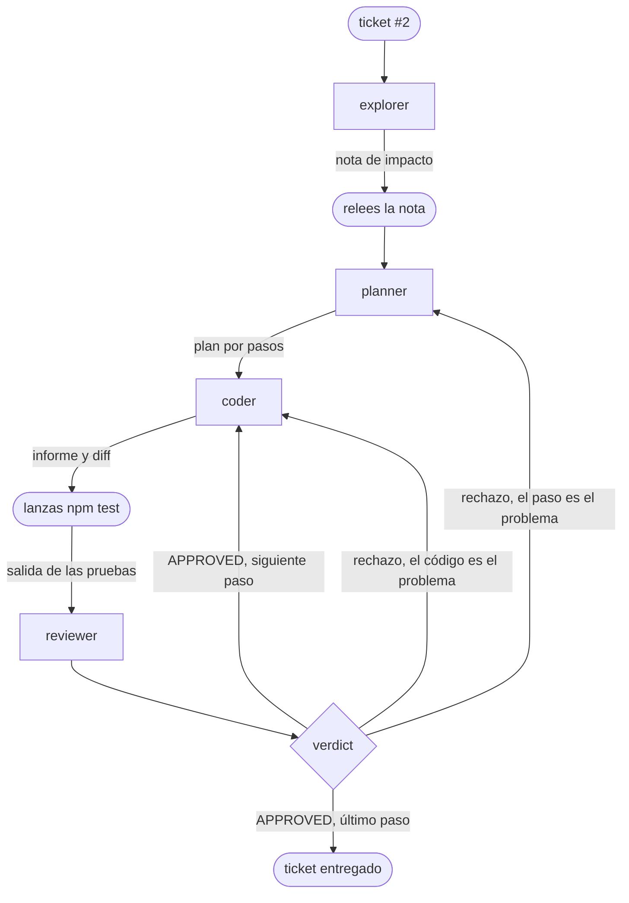

# Los workflows: el bucle escrito en un archivo

::: tip Objetivos de este módulo
- Reconocer en el bucle del módulo anterior los patrones de un flujo de trabajo
- Escribir este bucle en un archivo que Pi ejecute por sí solo
- Hacer que las pruebas sean el juez final y elegir dónde el humano mantiene el control
- Adaptar este archivo a tus propias necesidades en unas pocas líneas
:::

En el módulo anterior, tú eras el orquestador. Lanzabas cada agente con `/step`, releías la nota, ejecutabas `npm test` en una segunda terminal y decidías, tras cada veredicto, quién retomaba el control. Es instructivo una vez. Repetir estos pasos veinte veces lo es mucho menos, y es precisamente el tipo de tarea repetitiva que debe automatizarse.

Este módulo escribe estos pasos en un archivo. combo llama a este archivo un **flow**: un grafo de tareas descrito en YAML y Markdown, ubicado junto a tus agentes y ejecutado por el código en lugar de por un modelo. Veremos que no hay ningún lenguaje que aprender y que tu harness se modifica como cualquier otro archivo de configuración.

Te recordamos que la herramienta combo fue escrita específicamente para esta formación y que puede que no sea recomendable utilizarla en producción hoy en día. Puede que esto cambie en el futuro. La idea es siempre permitirte experimentar de forma rápida y sencilla.

## Comprender

### ¿Qué es un flujo de trabajo?

Si analizamos el módulo anterior con perspectiva, los pasos que encadenamos forman un grafo. Los rectángulos son los subagentes lanzados con `/step` y las formas redondeadas son las acciones que realizabas tú mismo:



Este grafo se descompone en algunos patrones que se encuentran en la mayoría de los sistemas multiagente. Cada figura indica arriba a la derecha cómo se escribe en un flow. Dos patrones tienen su propio nodo: el fan-out y el bucle. Los otros tres son simplemente nodos puestos uno tras otro.

- **chain**: el planner recibe la nota del explorer, el coder recibe el plan.

  {.only-light}
  {.only-dark}

- **fan-out**: el explorer y el tester leen el ticket al mismo tiempo, ya que ninguno de los dos escribe.

  {.only-light}
  {.only-dark}

- **orchestrate**: el planner decide cuántos pasos hacen falta, y luego cada paso pasa al coder.

  {.only-light}
  {.only-dark}

- **loop**: el coder y el reviewer reinician el proceso mientras el paso no esté validado.

  {.only-light}
  {.only-dark}

- **reduce**: un agente relee el resultado de varias ramas y extrae una única respuesta. En nuestro bucle, este es el papel del auditor.

{.only-light}
  {.only-dark}

### Un flow: tu bucle en un archivo

Veamos mejor qué resultado da con combo en un ejemplo concreto, la cadena explorer y luego planner:

```md
---
name: impact-plan
description: La note d'impact, puis le plan
input: string
nodes:
  - id: note
    agent: explorer
    reads: [input]
  - id: plan
    agent: planner
    reads: [input, note]
---

## note
Rends la note d'impact du ticket désigné sous `input`.

## plan
Découpe le ticket désigné sous `input` en petits pas, avec la note sous `note` comme carte.
```

El encabezado describe la estructura: los nodos, en orden, y lo que lee cada uno. El cuerpo da a cada agente su instrucción, una sección `## <id>` por nodo. Cada agente recibe su sección y los elementos listados en `reads:`, nada más. Es exactamente lo que hacías al pegar a mano el ticket, el paso y el diff en el mensaje del reviewer.

El archivo se verifica por completo antes de que se ejecute cualquier modelo.

::: info Ejercicio (en clase)
Si aún no lo has hecho, instala la extensión combo

```bash
cd /chemin/vers/neon
pi install -l npm:@ai-for-dev/combo
pi
```

Añade este archivo en `.pi/flows/impact-plan.md` y pruébalo en el issue #2. Puedes ver a los agentes evolucionar en herdr.
:::

### Automatización del orquestador

En la sesión anterior, llevaste a cabo la orquestación de las diferentes etapas que constituyen la resolución de un bug. Aquí vamos a automatizar este proceso de la siguiente manera:

| en el módulo anterior                          | en el flow                                                                    |
| -------------------------------------------- | ------------------------------------------------------------------------------- |
| `/step explorer`, y probarlo aparte        | un `parallel` de dos agentes                                                    |
| el planner devuelve un plan en pasos               | un `agent` cuya salida es una lista de pasos                                  |
| das un paso al coder, y luego el siguiente | un `map` sobre esta lista, un paso tras otro                                  |
| lanzas `npm test`                       | un `check` que lanza `.pi/checks/test.sh`                                       |
| el veredicto y el retorno al coder            | una `loop` hasta que los tests pasen y el reviewer apruebe         |
| el retorno al planner                         | una segunda vuelta: el auditor relee todo y el planner replanifica lo que queda |
| `/chain` y tu registro                    | el directorio `runs/<timestamp>/`, con el trazo de cada agente               |

Hemos visto en los módulos anteriores que era importante realizar cada etapa de un plan de manera separada. Es posible pedirle a combo que formatee la salida. Eso es lo que haremos aquí, pidiendo que cree una lista de pasos.

### Los tests tienen la última palabra

Necesitamos un paso fiable para saber si los cambios realizados responden claramente a nuestras necesidades. Podríamos pedirlo en el prompt, pero ya has visto que no tienes la certeza del 100 % de que se haya hecho. Por lo tanto, preferimos definir un script de bash que represente las acciones a realizar después de cada cambio. En un flow, el nodo `check` permite precisamente hacer eso ejecutando un script de tu proyecto. Su resultado es un valor que el bucle lee: con `loop: tests.output.passed && review.output.approved`, el coder sabe qué debe hacer si el código que ha generado es incorrecto o si no sigue exactamente el marco de desarrollo (un linter, por ejemplo).

{.only-light}
{.only-dark}

## Reconstruir

### El flow del ticket #2

Aquí tienes el bucle del módulo anterior escrito completo. Utiliza tus seis agentes sin modificarlos.

```md
---
name: issue2
description: Le tour de boucle du module précédent, de la note d'impact à l'audit
input: string
timeout: 15m

nodes:
  # Les deux lectures du ticket, en même temps : aucune des deux n'écrit.
  - id: survey
    parallel:
      impact:
        - id: note
          agent: explorer
          retry: 1
          reads: [input]
      cases:
        - id: cases
          agent: tester
          retry: 1
          reads: [input]

  # Le retour au planner : un second tour replanifie ce que l'audit a laissé ouvert.
  - id: round
    loop: suite.output.passed && audit.output.approved
    max: 2
    ledger: round
    do:
      - id: plan
        agent: planner
        retry: 1
        reads: [input, survey.output.impact.output, survey.output.cases.output, round.ledger]
        output: { steps: [{ text: string }] }

      # Un pas après l'autre, dans le même arbre.
      - id: steps
        map-from: plan.output.steps
        max: 6
        do:
          # Le retour au coder : jusqu'à trois essais par pas.
          - id: step
            loop: tests.output.passed && review.output.approved
            max: 3
            ledger: step
            on-fail: continue
            do:
              - id: code
                agent: coder
                retry: 1
                memory: step
                reads: [input, item.text, step.previous.tests, step.previous.review, step.ledger]

              - id: tests
                check: .pi/checks/test.sh

              - id: review
                agent: reviewer
                retry: 1
                memory: step
                verdict: step
                reads: [input, item.text, code, diff, tests]

      - id: suite
        check: .pi/checks/test.sh

      - id: audit
        agent: auditor
        retry: 1
        verdict: round
        reads: [input, steps, suite, diff, round.ledger]
---

## note
Rends la note d'impact du ticket désigné sous `input`.

## cases
Liste les cas de test dont le ticket désigné sous `input` a besoin, en disant
lesquels existent déjà. Commence par les comportements que l'extraction ne
doit pas changer.

## plan
Découpe le ticket désigné sous `input` en petits pas, avec la note d'impact et
le plan de tests comme carte. `remark` porte la remarque de la personne qui a
lancé le run, vide si elle n'en a pas fait. Quand `round.ledger` n'est pas
vide, c'est un second tour : ne planifie que ce que l'audit a soulevé et que
personne n'a fermé.

Le contrat est celui du ticket, pas le tien :

- la nouvelle fonction est `brickHit(ball, bricks)`, exportée de `game/neon.js` ;
- elle est pure : elle rend le tableau de toutes les briques vivantes que la
  balle chevauche, et ne modifie rien ;
- `frame()` se comporte exactement comme avant, y compris quand la balle
  chevauche plusieurs briques : chacune meurt dans la même frame, avec un
  incrément de combo chacune. Ce comportement est épinglé par un test avant de
  déplacer la logique, avec une balle de rayon 7 centrée dans l'espace entre
  deux briques voisines.

Le coder ne voit que le texte de son pas : nomme les fichiers, redis la partie
du contrat que le pas touche, et dis à quoi ressemble « fini ». Chaque pas
commence par son test rouge, écrit dans `game/neon.test.js`, et finit sur une
suite verte : le test rouge et le code qui le fait passer vont dans le même
pas, jamais dans deux.

## code
Exécute le pas décrit sous `item.text`, et lui seul.

Quand `step.previous.review` suit, le reviewer n'a pas approuvé ton dernier
changement : traite chaque remarque et chaque obligation de `step.ledger`, ou
dis clairement pourquoi tu ne le fais pas. `step.previous.tests` donne la
sortie de la suite après ce changement.

## review
Relis le changement fait pour le pas décrit sous `item.text`. Le rapport du
coder est sous `code`, le changement sous `diff`, la sortie de la suite sous
`tests`. Le rapport est une affirmation, le diff et le code sont la preuve.
Approuve, ou soulève ce qui doit encore changer.

## audit
Relis tout le changement sous `diff` contre le ticket désigné sous `input`.
`steps` dit comment la relecture de chaque pas s'est terminée : un pas qui n'a
pas convergé n'est pas fait tant que le code ne le montre pas. `suite` dit si
les tests du projet passent. `round.ledger` porte ce qu'un audit précédent a
soulevé et que personne n'a fermé.

Approuve le tout, ou soulève chaque correction sur sa propre ligne.
```

Algunas observaciones sobre este flow

- Los pasos se suceden en el mismo árbol, como tus `/step`.
- Tres intentos por paso y dos vueltas como máximo. Un límite es obligatorio en cada bucle: sin él, un modelo que nunca converja ejecutaría hasta agotar el presupuesto. Si tu flow falla al alcanzar este límite, combo te lo dirá.
- El contrato del ticket está escrito en la sección del planner para asegurar que las peticiones del usuario figuren correctamente. La fase de exploración puede ocultarlas.
- `retry: 1` en cada agente. En la primera ejecución real de este flow, el planner escribió un plan muy bueno, pero en texto libre, sin usar la herramienta prevista, y la ejecución se detuvo. Un segundo intento, con el error nombrado, fue suficiente.
- Cada paso termina con una suite verde. Otra ejecución planificó un paso de « escribir los tests rojos » solo, sin el código. El bucle exige una suite verde, por lo que este paso no podía completarse y agotó sus tres intentos. Cuando un bucle no converja, comprueba primero si su condición era alcanzable.

Se añaden dos roles aquí. El tester (`scripts/agents/tester.md`) permite verificar si los tests existen y si hay que añadir más. El auditor (`scripts/agents/auditor.md`) se asegura de que el trabajo se haya realizado en su totalidad y que no se haya olvidado nada, ya que el reviewer solo ve un paso. Lo que el auditor señale permanecerá abierto hasta que alguien lo resuelva, y el flow comenzará una segunda vuelta.

::: warning  Un punto sobre estas decisiones
Te recordamos que el objetivo de esta formación es darte todos los elementos para construir tu harness. Las decisiones tomadas aquí son, por tanto, discutibles y quizá no sean las óptimas para obtener los mejores resultados. Pero tienes toda la comprensión necesaria para eliminar nodos, añadir nuevos o modificarlos.
:::

::: info Ejercicio (en aula)
Sube los agentes, el flow y el script de tests a tu clon de NÉON :

```bash
cd /chemin/vers/neon
mkdir -p .pi/agents .pi/flows .pi/checks
cp /chemin/vers/hands-on-harness/scripts/agents/*.md .pi/agents/
# Collez le flow ci-dessus dans .pi/flows/issue2.md
printf '#!/usr/bin/env bash\nnpm test\n' > .pi/checks/test.sh

printf '.pi/\nruns/\n' >> .gitignore
git add .gitignore && git commit -m "ignorer .pi et runs"

pi install -l git:github.com/AI-for-dev/combo
pi
```

En el primer lanzamiento, Pi te preguntará si confías en la carpeta del proyecto: sin esto, no cargará ni `.pi/` ni combo. Elige « Trust ».

Verifica lo que Pi ha cargado antes de ejecutar cualquier cosa:

```prompt
/flows
/flows issue2
```

El primer comando lista los flows encontrados, el segundo muestra el plan de `issue2` nodo por nodo. Luego, rompe el archivo a propósito sustituyendo `agent: coder` por `agent: codeur`, ejecuta `/flows` de nuevo y lee la denegación: nombra el nodo y propone el nombre correcto. Vuelve a poner `coder` y, a continuación, lanza el bucle:

```prompt
/run issue2 traite le ticket #2 d'ISSUES.md
```

Pi dibuja el flow sobre el prompt mientras avanza. La tarjeta de observación aparece después de la nota de impacto; después, todo lo que hacías a mano se encadena automáticamente.

Al final, haz tus propias verificaciones, las del módulo anterior: `npm test`, la lista de exports, `git diff` y la traza en `runs/<horodatage>/`. No te quedes solo con el veredicto del flow.
:::

Una ejecución interrumpida se reanuda con `/run resume`, desde donde se había detenido.

### Adaptar el harness a tus necesidades

Este flow es un punto de partida. Cada modificación posterior ocupa unas pocas líneas, y `/flows issue2` te indica si es válida antes de cualquier ejecución.

El flow se detiene en la auditoría y tú eres quien hace el commit. Para que te proponga el commit, añade al final una pregunta, una ramificación y el commit:

{.only-light}
{.only-dark}

```yaml
  - id: go
    ask: "Commiter ce changement ?"
    confirm: true
    default: false
    reads: [diff]

  - id: ship
    choice:
      - when: go.output.yes
        do:
          - id: message
            agent: committer
            reads: [input, diff]
          - id: commit
            commit: message
    default: []
```

Añade una sección `## message` que indique al committer qué debe escribir. El `committer` viene incluido con combo, el commit se realiza en una rama propia de la ejecución y no se hace push de nada. Con `default: false`, una ejecución sin nadie frente a la pantalla no hace el commit.

Un flow que funciona se convierte también en un bloque. Un nodo `flow` llama a otro flow completo: tu `issue2` puede servir en un flow más amplio sin necesidad de copiarlo.

{.only-light}
{.only-dark}

```md
---
name: ticket
description: Le flow issue2 comme une brique, puis le commit
input: string
nodes:
  - id: work
    flow: issue2
    input: input

  - id: message
    agent: committer
    retry: 1
    reads: [input, diff]

  - id: commit
    commit: message
---

## message
Écris le message de commit du changement sous `diff`, fait pour la demande sous `input`.
```

El resto sigue la misma lógica. Un modelo más grande para el planner y el auditor se configura en sus archivos de agentes. Una auditoría que no aporta nada en un ticket pequeño se elimina borrando su nodo y simplificando la condición del turno. Pasos independientes pueden ejecutarse en paralelo, cada uno en su propia copia del repositorio (`concurrency: 2` y `copies: true` en el `map`).

::: info Ejercicio (autónomo)
Añade la detención antes del commit y vuelve a ejecutar el ticket. Intenta después una modificación propia: otra división de roles, un modelo más grande donde se juzga, un flow para otro tipo de ticket. La pregunta que debes hacerte es siempre la misma: ¿qué acción repetías a mano y qué línea la escribiría?
:::

### ¿Y la medición? (Para hacer con trysquare)


## Generalizar

Automatizar un bucle requiere haberla ejecutado a mano o analizar detalladamente las trazas. El flow de este módulo es tu diario del módulo anterior reescrito: cada línea responde a una decisión que has tomado tú mismo, y es por eso que sabes dónde colocarla.

El harness se construye mediante correcciones sucesivas. Cada fallo leído en la traza se convierte en una modificación del flujo.

Las pruebas tienen la última palabra, pero solo verifican aquello que restringen. Una suite en verde no prueba que el ticket esté terminado.

Una decisión merece su propio canal. Mientras un veredicto se lea en prosa, dependerá de la forma en que el modelo escriba una palabra como, por ejemplo, `APPROVED`. Cuando sea posible, dale una herramienta para responder. Puedes apoyarte en https://laya.convaiinnovations.com/, que permite tomar decisiones mucho más precisas que con un LLM clásico.

Las detenciones humanas son decisiones de diseño. Colócalas donde un error cueste más caro de deshacer que de prevenir, y en ningún otro lugar. En nuestro caso, una discusión de preguntas y respuestas sobre el ticket para enriquecer el plan podría ser una buena idea.

## Entregable

Este módulo produce tres piezas.

1. Tu flow `.pi/flows/issue2.md` y el script `.pi/checks/test.sh`, versionados con tus agentes, en la versión que hayas adaptado.
2. La traza de una ejecución completa, el directorio `runs/<timestamp>/` de un `/run issue2` sobre el ticket #2.
3. La línea « workflows » de la ficha de decisión, a continuación.

::: tip Criterio de éxito
Sabes decir, con la traza en mano, por qué una ejecución tuvo éxito o no: qué paso no convergió, si la secuencia estaba en rojo, qué dejó abierto el auditor. Puedes hacer evolucionar tu flujo de trabajo para intentar obtener un harness que siga tu manera de trabajar y sentirte seguro del resultado.
:::


## Para profundizar

- Anthropic, [Building Effective Agents](https://www.anthropic.com/engineering/building-effective-agents), la distinción workflows / agents y los patrones de este módulo en su forma general.
- [La documentación de combo](https://github.com/AI-for-dev/combo/tree/main/docs), en particular la página sobre los flows y los flows `build` y `build-attended` incluidos con combo, que hacen de forma más genérica lo que este módulo hace en un ticket.
- [herdr](https://herdr.dev), para observar el funcionamiento de un flow, un panel por agente.
