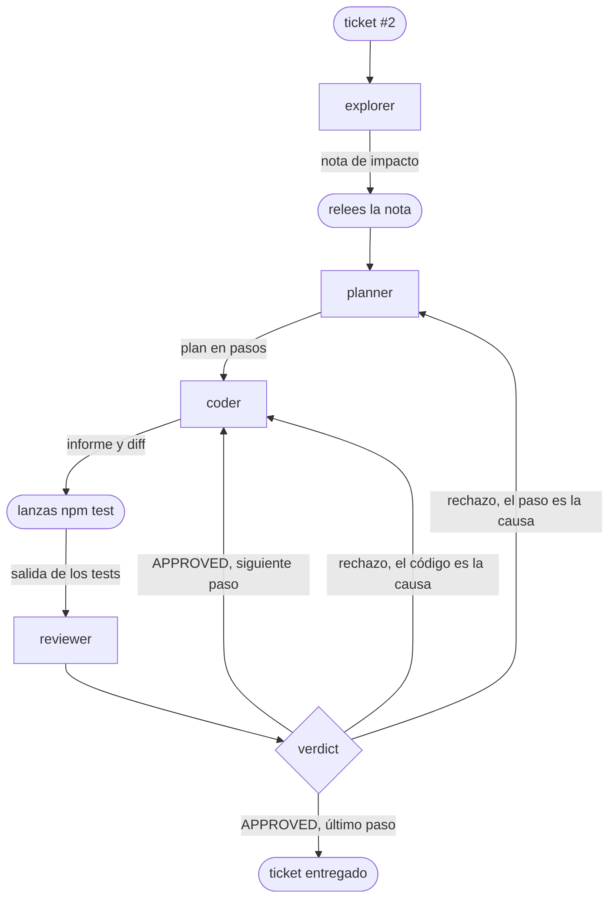

# Los flujos de trabajo: el bucle escrito en un archivo

::: tip Objetivos de este módulo
- Reconocer en el bucle del módulo anterior los patrones de un flujo de trabajo
- Escribir ese bucle en un archivo que Pi ejecute solo
- Hacer de los tests el juez final, y elegir dónde el humano conserva el control
- Adaptar este archivo a tus propias necesidades en unas pocas líneas
:::

En el módulo anterior, tú eras el orquestador. Lanzabas cada agente con `/step`, releías la nota, ejecutabas `npm test` en una segunda terminal y decidías, tras cada veredicto, quién retomaba el control. Es instructivo una vez. Repetir estos gestos veinte veces lo es mucho menos, y es precisamente el tipo de tarea repetitiva que hay que automatizar.

Este módulo escribe estos gestos en un archivo. combo llama a este archivo un **flow**: un grafo de tareas descrito en YAML y en markdown, colocado junto a tus agentes, y ejecutado por el código en lugar de por un modelo. Vamos a ver que no hay ningún lenguaje que aprender y que tu harness se modifica como cualquier archivo de configuración.

Te recordamos que la herramienta combo fue escrita específicamente para esta formación y que quizá no sea recomendable utilizarla en producción hoy en día. Quizá deje de ser el caso con el tiempo. La idea es siempre permitirte experimentar rápida y fácilmente.

## Comprender

### ¿Qué es un flujo de trabajo?

Si nos alejamos un poco del módulo anterior, los pasos que encadenamos forman un grafo. Los rectángulos son los subagentes lanzados por `/step` y las formas redondeadas, los gestos que hacías tú mismo:



Este grafo se descompone en algunos patrones que se encuentran en la mayoría de los sistemas multiagente. Cada figura indica en la parte superior derecha cómo se escribe el patrón en un flow. Dos patrones tienen su propio nodo: el fan-out y el bucle. Los otros tres son simplemente nodos puestos uno tras otro.

- **chain**: el planner recibe la nota del explorer, el coder recibe el plan.

  {.only-light}
  {.only-dark}

- **fan-out**: el explorer y el tester leen el ticket al mismo tiempo, ya que ninguno de los dos escribe.

  {.only-light}
  {.only-dark}

- **orchestrate**: el planner decide cuántos pasos hacen falta, y luego cada paso va al coder.

  {.only-light}
  {.only-dark}

- **loop**: el coder y el reviewer recomienzan mientras el paso no esté validado.

  {.only-light}
  {.only-dark}

- **reduce**: un agente relee el resultado de varias ramas y extrae una única respuesta. En nuestro bucle, ese es el papel del auditor.

{.only-light}
  {.only-dark}

### Un flow: tu bucle en un archivo

Veamos más bien qué da esto con combo en un ejemplo concreto, la cadena explorer y luego planner:

```md
---
name: impact-plan
description: La note d'impact, puis le plan
input: string
nodes:
  - id: note
    agent: explorer
    reads: [input]
  - id: plan
    agent: planner
    reads: [input, note]
---

## note
Rends la note d'impact du ticket désigné sous `input`.

## plan
Découpe le ticket désigné sous `input` en petits pas, avec la note sous `note` comme carte.
```

El encabezado describe la estructura: los nodos, en orden, y lo que cada uno lee. El cuerpo da a cada agente su consigna, una sección `## <id>` por nodo. Cada agente recibe su sección y los elementos listados en `reads:`, nada más. Es exactamente lo que hacías al pegar a mano el ticket, el paso y el diff en el mensaje del reviewer.

El archivo se verifica por completo antes de que ningún modelo se ejecute.

::: info Ejercicio (en clase)
Si aún no lo has hecho, instala la extensión combo

```bash
cd /chemin/vers/neon
pi install -l npm:@ai-for-dev/combo
pi
```

Añade este archivo a `.pi/flows/impact-plan.md` y pruébalo en la issue #2. Puedes ver a los agentes evolucionar en herdr.
:::

### Automatización del orquestador

En la sesión anterior llevaste la orquestación de las distintas etapas que componen la resolución de un bug. Aquí vamos a automatizar este proceso de la siguiente manera:

| en el módulo anterior                       | en el flow                                                                    |
| ------------------------------------------- | ----------------------------------------------------------------------------- |
| `/step explorer`, y probarlo a la vez        | un `parallel` de dos agentes                                                    |
| el planner entrega un plan en pasos          | un `agent` cuya salida es una lista de pasos                                    |
| le das un paso al coder, luego el siguiente  | un `map` sobre esa lista, un paso tras otro                                     |
| ejecutas `npm test`                          | un `check` que lanza `.pi/checks/test.sh`                                       |
| el veredicto, y el retorno al coder          | un `loop` hasta que los tests pasen y el reviewer apruebe                       |
| el retorno al planner                        | una segunda vuelta: el auditor relee todo y el planner replanifica lo que queda |
| `/chain` y tu registro                       | el directorio `runs/<horodatage>/`, con la traza de cada agente                 |

Hemos visto en los módulos anteriores que era importante hacer cada paso de un plan de manera separada. Es posible pedirle a combo que formatee la salida. Eso es lo que haremos aquí pidiéndole que haga una lista de pasos.

### Los tests tienen la última palabra

Necesitamos un paso fiable para saber si los cambios realizados responden claramente a nuestras necesidades. Podríamos pedirlo en el prompt, pero ya has visto que no tienes una certeza al 100 % de que se haga. Preferimos entonces definir un script bash que represente las acciones a realizar después de cada cambio. En un flow, el nodo `check` permite justamente hacer eso lanzando un script de tu proyecto. Su resultado es un valor que el bucle lee: con `loop: tests.output.passed && review.output.approved`, el coder sabe lo que debe hacer si el código que ha generado es incorrecto o si no sigue exactamente el marco de desarrollo (el linter, por ejemplo).

{.only-light}
{.only-dark}

## Reconstruir

### El flow del ticket #2

Aquí está el bucle del módulo anterior escrito por completo. Utiliza tus seis agentes sin modificarlos.

```md
---
name: issue2
description: Le tour de boucle du module précédent, de la note d'impact à l'audit
input: string
timeout: 15m

nodes:
  # Les deux lectures du ticket, en même temps : aucune des deux n'écrit.
  - id: survey
    parallel:
      impact:
        - id: note
          agent: explorer
          retry: 1
          reads: [input]
      cases:
        - id: cases
          agent: tester
          retry: 1
          reads: [input]

  # Le retour au planner : un second tour replanifie ce que l'audit a laissé ouvert.
  - id: round
    loop: suite.output.passed && audit.output.approved
    max: 2
    ledger: round
    do:
      - id: plan
        agent: planner
        retry: 1
        reads: [input, survey.output.impact.output, survey.output.cases.output, round.ledger]
        output: { steps: [{ text: string }] }

      # Un pas après l'autre, dans le même arbre.
      - id: steps
        map-from: plan.output.steps
        max: 6
        do:
          # Le retour au coder : jusqu'à trois essais par pas.
          - id: step
            loop: tests.output.passed && review.output.approved
            max: 3
            ledger: step
            on-fail: continue
            do:
              - id: code
                agent: coder
                retry: 1
                memory: step
                reads: [input, item.text, step.previous.tests, step.previous.review, step.ledger]

              - id: tests
                check: .pi/checks/test.sh

              - id: review
                agent: reviewer
                retry: 1
                memory: step
                verdict: step
                reads: [input, item.text, code, diff, tests]

      - id: suite
        check: .pi/checks/test.sh

      - id: audit
        agent: auditor
        retry: 1
        verdict: round
        reads: [input, steps, suite, diff, round.ledger]
---

## note
Rends la note d'impact du ticket désigné sous `input`.

## cases
Liste les cas de test dont le ticket désigné sous `input` a besoin, en disant
lesquels existent déjà. Commence par les comportements que l'extraction ne
doit pas changer.

## plan
Découpe le ticket désigné sous `input` en petits pas, avec la note d'impact et
le plan de tests comme carte. `remark` porte la remarque de la personne qui a
lancé le run, vide si elle n'en a pas fait. Quand `round.ledger` n'est pas
vide, c'est un second tour : ne planifie que ce que l'audit a soulevé et que
personne n'a fermé.

Le contrat est celui du ticket, pas le tien :

- la nouvelle fonction est `brickHit(ball, bricks)`, exportée de `game/neon.js` ;
- elle est pure : elle rend le tableau de toutes les briques vivantes que la
  balle chevauche, et ne modifie rien ;
- `frame()` se comporte exactement comme avant, y compris quand la balle
  chevauche plusieurs briques : chacune meurt dans la même frame, avec un
  incrément de combo chacune. Ce comportement est épinglé par un test avant de
  déplacer la logique, avec une balle de rayon 7 centrée dans l'espace entre
  deux briques voisines.

Le coder ne voit que le texte de son pas : nomme les fichiers, redis la partie
du contrat que le pas touche, et dis à quoi ressemble « fini ». Chaque pas
commence par son test rouge, écrit dans `game/neon.test.js`, et finit sur une
suite verte : le test rouge et le code qui le fait passer vont dans le même
pas, jamais dans deux.

## code
Exécute le pas décrit sous `item.text`, et lui seul.

Quand `step.previous.review` suit, le reviewer n'a pas approuvé ton dernier
changement : traite chaque remarque et chaque obligation de `step.ledger`, ou
dis clairement pourquoi tu ne le fais pas. `step.previous.tests` donne la
sortie de la suite après ce changement.

## review
Relis le changement fait pour le pas décrit sous `item.text`. Le rapport du
coder est sous `code`, le changement sous `diff`, la sortie de la suite sous
`tests`. Le rapport est une affirmation, le diff et le code sont la preuve.
Approuve, ou soulève ce qui doit encore changer.

## audit
Relis tout le changement sous `diff` contre le ticket désigné sous `input`.
`steps` dit comment la relecture de chaque pas s'est terminée : un pas qui n'a
pas convergé n'est pas fait tant que le code ne le montre pas. `suite` dit si
les tests du projet passent. `round.ledger` porte ce qu'un audit précédent a
soulevé et que personne n'a fermé.

Approuve le tout, ou soulève chaque correction sur sa propre ligne.
```

Algunas observaciones sobre este flow

- Los pasos se suceden en el mismo árbol, como tus `/step`.
- Tres intentos por paso y dos rondas como máximo. Un tope es obligatorio en cada bucle: sin él, un modelo que nunca converge se ejecutaría hasta agotar el presupuesto. Si tu flow falla al alcanzar este límite, combo te lo dirá.
- El contrato del ticket se escribe en la sección del planner para asegurarse de que las peticiones del usuario figuren en él. La fase de exploración puede ocultarlas.
- `retry: 1` en cada agente. En el primer run real de este flow, el planner escribió un muy buen plan, pero en texto libre, sin usar la herramienta prevista, y el run se detuvo. Un segundo intento, con el error ya señalado, fue suficiente.
- Cada paso termina en una suite en verde. Otro run planificó un paso «escribir los tests en rojo» solo, sin el código. El bucle exige una suite en verde, por lo tanto este paso no podía completarse y quemó sus tres intentos. Cuando un bucle no converge, mira primero si su condición era alcanzable.

Aquí se añaden dos roles. El tester (`scripts/agents/tester.md`) permite verificar si los tests existen y si hay que añadir más. El auditor (`scripts/agents/auditor.md`) se asegura de que el trabajo se realiza en su totalidad y de que no se haya olvidado nada, mientras que el reviewer solo ve un paso. Lo que plantea permanece abierto mientras nadie lo haya tratado, y el flow arranca una segunda ronda.

::: warning  Un apunte sobre estas decisiones
Te recordamos que el objetivo de esta formación es darte todos los elementos para construir tu harness. Las decisiones tomadas aquí son, por tanto, discutibles y quizá no óptimas para obtener los mejores resultados. Pero tienes toda la comprensión necesaria para quitar nodos, añadirlos o modificarlos.
:::

::: info Ejercicio (en clase)
Coloca los agentes, el flow y el script de tests en tu clon de NÉON:

```bash
cd /chemin/vers/neon
mkdir -p .pi/agents .pi/flows .pi/checks
cp /chemin/vers/hands-on-harness/scripts/agents/*.md .pi/agents/
# Collez le flow ci-dessus dans .pi/flows/issue2.md
printf '#!/usr/bin/env bash\nnpm test\n' > .pi/checks/test.sh

printf '.pi/\nruns/\n' >> .gitignore
git add .gitignore && git commit -m "ignorer .pi et runs"

pi install -l git:github.com/AI-for-dev/combo
pi
```

En el primer lanzamiento, Pi te pregunta si confías en la carpeta del proyecto: sin eso, no carga ni `.pi/` ni combo. Elige «Trust».

Comprueba lo que Pi ha cargado antes de lanzar nada:

```prompt
/flows
/flows issue2
```

El primer comando lista los flows encontrados, el segundo muestra el plan de `issue2` nodo por nodo. Luego rompe el archivo a propósito reemplazando `agent: coder` por `agent: codeur`, vuelve a lanzar `/flows` y lee el rechazo: nombra el nodo y propone el nombre correcto. Vuelve a poner `coder`, y luego lanza el bucle:

```prompt
/run issue2 traite le ticket #2 d'ISSUES.md
```

Pi dibuja el flow encima del prompt mientras avanza. La tarjeta de observación aparece después de la nota de impacto; a continuación, todo lo que hacías a mano se encadena sin ti.

Al final, haz tus propias verificaciones, las del módulo anterior: `npm test`, la lista de exports, `git diff` y la traza en `runs/<horodatage>/`. No te conformes con el veredicto del flow.
:::

Un run interrumpido se reanuda con `/run resume`, donde se había detenido.

### Adaptar el harness a tus necesidades

Este flow es un punto de partida. Cada modificación que sigue ocupa unas pocas líneas, y `/flows issue2` te dice antes de cualquier lanzamiento si es válida.

El flow se detiene en la auditoría y eres tú quien hace el commit. Para que te proponga el commit, añade al final una pregunta, una bifurcación y el commit :

{.only-light}
{.only-dark}

```yaml
  - id: go
    ask: "Commiter ce changement ?"
    confirm: true
    default: false
    reads: [diff]

  - id: ship
    choice:
      - when: go.output.yes
        do:
          - id: message
            agent: committer
            reads: [input, diff]
          - id: commit
            commit: message
    default: []
```

Añade una sección `## message` que le diga al committer lo que debe escribir. El `committer` se entrega con combo, el commit va a una rama propia del run y no se sube nada. Con `default: false`, un run sin nadie frente a la pantalla no hace commit.

Un flow que funciona se convierte también en un bloque. Un nodo `flow` llama a otro flow completo : tu `issue2` puede servir en un flow más amplio sin ser copiado.

{.only-light}
{.only-dark}

```md
---
name: ticket
description: Le flow issue2 comme une brique, puis le commit
input: string
nodes:
  - id: work
    flow: issue2
    input: input

  - id: message
    agent: committer
    retry: 1
    reads: [input, diff]

  - id: commit
    commit: message
---

## message
Écris le message de commit du changement sous `diff`, fait pour la demande sous `input`.
```

El resto sigue la misma lógica. Un modelo más grande para el planner y el auditor se configura en sus archivos de agentes. Una auditoría que no aporta nada en un ticket pequeño se elimina suprimiendo su nodo y simplificando la condición de la iteración. Pasos independientes pueden ejecutarse en paralelo, cada uno en su copia del repositorio (`concurrency: 2` y `copies: true` en el `map`).

::: info Ejercicio (en autonomía)
Añade la parada antes del commit y vuelve a ejecutar el ticket. Prueba luego una modificación propia : otro reparto de roles, un modelo más grande donde se considere, un flow para otro tipo de ticket. La pregunta que debes hacerte es siempre la misma : ¿qué gesto repetías a mano, y qué línea lo escribiría ?
:::

### ¿Y la medida? (Para hacer con trysquare)


## Generalizar

Automatizar un bucle exige haberlo ejecutado a mano o analizar finamente las trazas. El flow de este módulo es tu diario del módulo anterior reescrito : cada línea responde a una decisión que tomaste tú mismo, y por eso sabes dónde colocarla.

El harness se construye mediante correcciones sucesivas. Cada fallo leído en la traza se convierte en una modificación del flujo.

Los tests tienen la última palabra pero solo verifican lo que restringen. Una suite verde no prueba que el ticket esté hecho.

Una decisión merece su propio canal. Mientras un veredicto se lee en prosa, depende de la forma en que el modelo escribe una palabra como por ejemplo `APPROVED`. Cuando sea posible, dale una herramienta para responder. Puedes apoyarte en https://laya.convaiinnovations.com/ que permite tomar decisiones mucho más precisas que con un LLM clásico.

Las paradas humanas son elecciones de diseño. Colócalas donde un error cueste más caro de deshacer que de prevenir, y no en otro lugar. En nuestro caso, una discusión de preguntas y respuestas sobre el ticket para enriquecer el plan podría ser una buena cosa.

## Entregable

Este módulo produce tres piezas.

1. Tu flow `.pi/flows/issue2.md` y el script `.pi/checks/test.sh`, versionados junto con tus agentes, en la versión que hayas adaptado.
2. La traza de un run completo, el directorio `runs/<horodatage>/` de un `/run issue2` sobre el ticket #2.
3. La línea «workflows» de la ficha de decisión, a continuación.

::: tip Criterio de éxito
Puedes explicar, con la traza en mano, por qué una ejecución terminó o no: qué paso no convergió, si la suite de pruebas estaba en rojo, qué dejó abierto el auditor. Puedes hacer evolucionar tu flujo de trabajo para intentar conseguir un harness que siga tu forma de trabajar y confiar en el resultado.
:::


## Para profundizar

- Anthropic, [Building Effective Agents](https://www.anthropic.com/engineering/building-effective-agents), la distinción entre workflows y agentes, y los patrones de este módulo en su forma general.
- [La documentación de combo](https://github.com/AI-for-dev/combo/tree/main/docs), en particular la página sobre los flows y los flows `build` y `build-attended` incluidos con combo, que generalizan lo que este módulo hace sobre un ticket.
- [herdr](https://herdr.dev), para ver un flow trabajar, un panel por agente.
